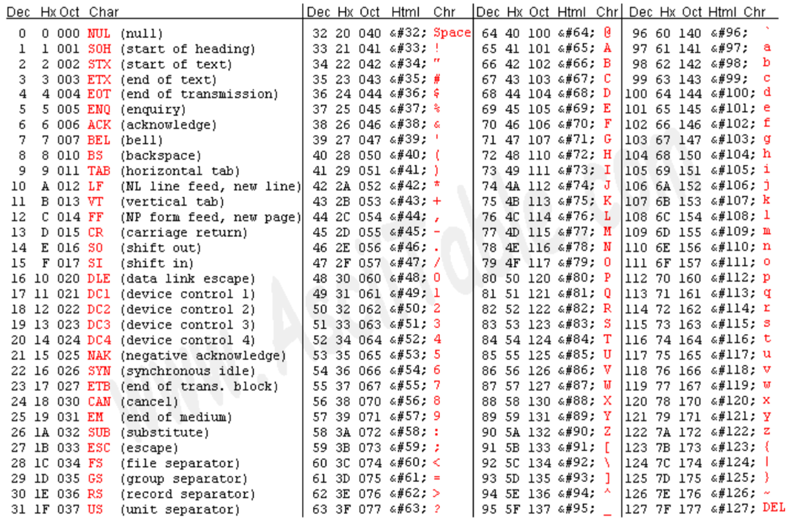

# 문자 데이터

## 1. 문자 집합

`문자 집합(character set)`은 컴퓨터가 인식하고 표현할 수 있는 문자의 집합이다. 

문자 집합에 속한 문자여도, 이진수로 바꿔줘야 컴퓨터가 이해할 수 있다. 

`문자 인코딩(encoding)`: 문자 집합에 속한 문자 :arrow_right: 이진수의 문자 코드 

`문자 디코딩(decoding)`: 이진수의 문자 코드 :arrow_right: 사람이 이해할 수 있는 문자 

---

## 2. 아스키 코드

`아스키(ASCII)`는 초창기 문자집합 중 하나다. 

아스키 문자 집합은 `1byte (=8bit)`를 사용한다. 

- 1bit :arrow_right: 오류 검출을 위한 `패리티 비트(parity bit)` 
- 7bit :arrow_right: 실질적인 문자(**알파벳, 숫자, 특수문자**) 표현을 위해 사용 

따라서 아스키 문자 집합은 27 = 128개의 문자를 표현할 수 있다. 

아스키 문자에 대응된 고유의 수를 `아스키 코드`라고 한다. (`0` ~ `127`) 

---

## 3. 한글 인코딩 방식

`조합형 인코딩 방식`: 초성, 중성, 종성 각각의 비트열을 조합해 하나의 글자 코드를 완성한다. 

- 1980~90년대에 사용, 현재는 사용하지 않는다. 
- 종류: n바이트 조합형, 3바이트 조합형, 2바이트 조합형, ... 

 

`완성형 인코딩 방식`: 한글 한 글자에 고유한 코드를 부여한다. 

- 종류: **EUC-KR** (한글 2350자), **CP949**(한글 11172자), ... 
- 모든 한글을 표현할 수 없다는 한계가 있다. 

 

`유니코드(unicode)`는 현대 문자를 표현할 때 가장 많이 사용되는 `통일된 표준 문자 집합`이다. 

- **이전 인코딩 방식**: 글자에 부여된 값 :arrow_right: 그대로 인코딩 값으로 사용 
- **유니코드**: 글자에 부여된 값 :arrow_right: 다양한 방법으로 인코딩 (이러한 인코딩 방법에 `UTF-8`, UTF-16, UTF-32 등이 있다) 

---

