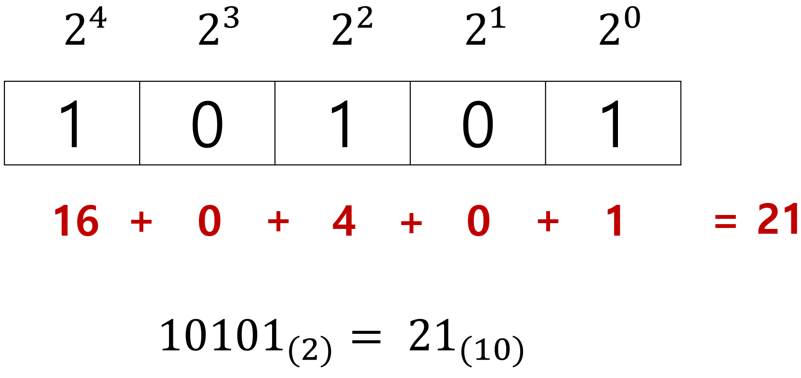
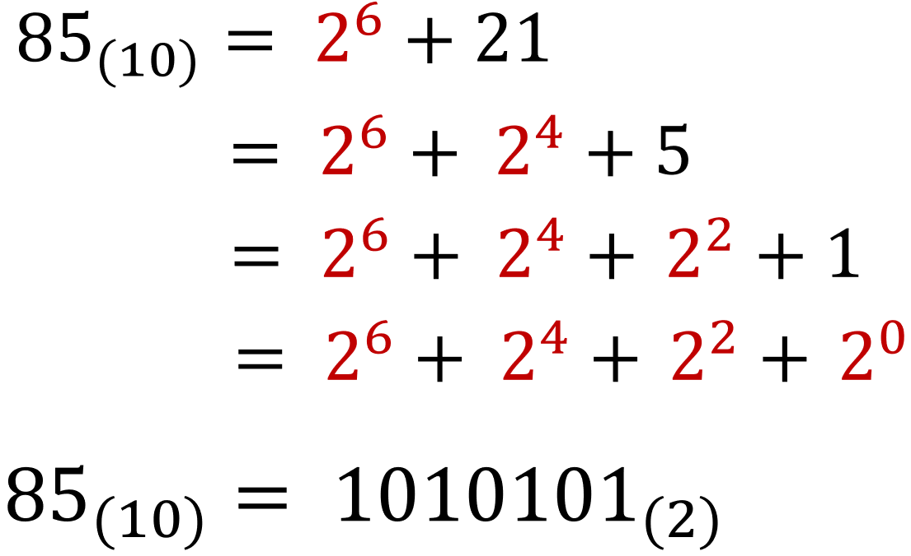
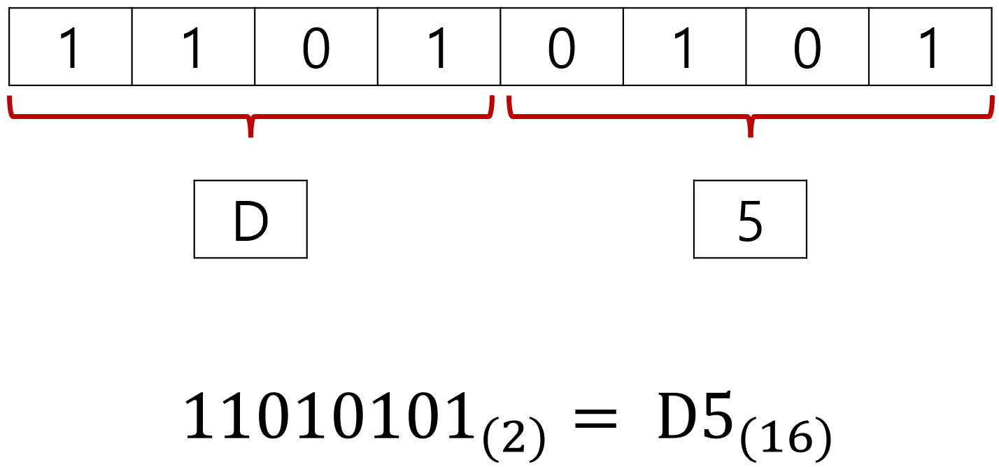
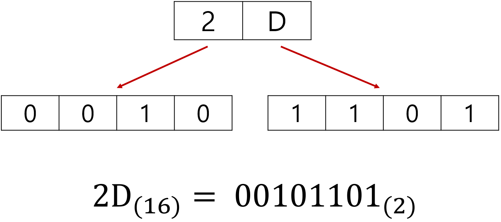
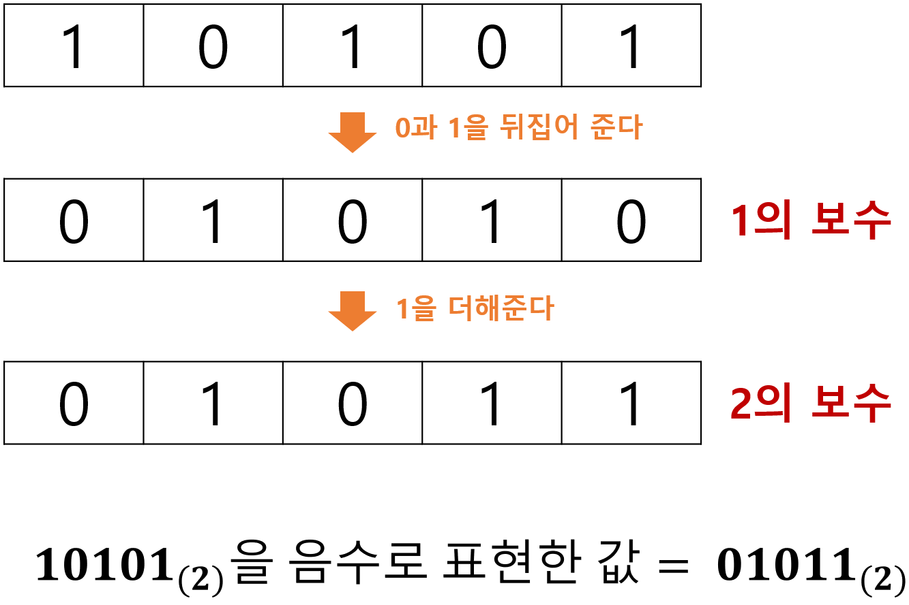

# 숫자 데이터

## 01. 정보 단위

`비트(bit)`는 0과 1을 나타내는 가장 작은 정보 단위다. 

컴퓨터는 `0`과 `1`만을 이해한다. 

1비트는 `0` 또는 `1`을 표현할 수 있다. 

따라서 n비트는 2n 개의 정보를 표현할 수 있다. 

 

`바이트(byte)`는 8개의 비트를 묶은 단위다. (`1byte = 8bit`) 

바이트보다 더 큰 정보 단위는 다음과 같다. 

- 1byte(바이트) = 8bit
- 1KB(킬로바이트) = 1000byte
- 1MB(메가바이트) = 1000KB
- 1GB(기가바이트) = 1000MB
- 1TB(테라바이트) = 1000GB

 

`워드(word)`는 CPU가 한 번에 처리할 수 있는 데이터 크기를 의미한다. 

CPU가 한 번에 32bit를 처리할 수 있다 :arrow_right: 1word = 32bit 

현대 컴퓨터의 워드 크기는 대부분 32bit 또는 64bit다. 

- 하프 워드(half word): 정의된 워드의 절반 크기 
- 풀 워드(full word): 정의된 워드의 1배 크기 
- 더블 워드(double word): 정의된 워드의 2배 크기 

---

## 02. 이진법 & 십육진법

`십진법(decimal)`은 0부터 9까지, 열 개의 숫자로 모든 수를 표현하는 방법이다. 

`이진법(binary)`은 0과 1만으로, 모든 숫자를 표현하는 방법이다. 

컴퓨터는 0과 1만 이해할 수 있기 때문에, 이진법을 사용한다. 

| **십진수** | 0    | 1    | 2    | 3    | 4    | 5    | 6    | 7    |
| ---------- | ---- | ---- | ---- | ---- | ---- | ---- | ---- | ---- |
| **이진수** | 0    | 01   | 10   | 11   | 100  | 101  | 110  | 111  |

- 이진수를 `수학적`으로 표기 :arrow_right: 숫자 뒤에 아래첨자 (2) 를 붙인다. 
- 이진수를 `코드 상`에서 표기 :arrow_right: 숫자 앞에 `0b`를 붙인다. 

 

이진법은 숫자의 길이가 너무 길어진다는 단점이 있다. 

따라서 데이터를 표현할 때, 이진수와 변환이 쉬운 십육진법도 자주 사용한다. 

`십육진법(hexadecimal)`은 15를 넘어가는 시점에 자리 올림을 하는 숫자 표현 방식이다. 

| **십진수**   | 1    | 2    | 3    | **...** | 9    | 10   | 11   | 12   | 13   | 14   | 15   |
| ------------ | ---- | ---- | ---- | ------- | ---- | ---- | ---- | ---- | ---- | ---- | ---- |
| **십육진수** | 1    | 2    | 3    | **...** | 9    | A    | B    | C    | D    | E    | F    |

- 십육진수를 `수학적`으로 표기 :arrow_right: 숫자 뒤에 아래첨자 (16) 을 붙인다. 
- 십육진수를 `코드 상`에서 표기 :arrow_right: 숫자 앞에 `0x`를 붙인다. 

---

## 03. 진수 변환

### I. 이진수 :arrow_right: 십진수

이진수의 각 자릿수 위에 2의 제곱수를 적는다. 

이진수의 각 자릿수와 2의 제곱수를 곱한 값을 합한다. 

 

### II. 십진수 :arrow_right: 이진수

십진수를 2의 제곱수의 합으로 나타내 이진수로 바꿔준다. 

 

### III. 이진수 :arrow_right: 십육진수

이진수 숫자를 4bit씩 끊는다. 

끊어준 4bit의 이진수를 하나의 십육진수로 변환해, 이어 붙인다. 

 

### IV. 십육진수 :arrow_right: 이진수

십육진수 한글자를 4비트의 이진수로 변환해, 이어 붙인다. 

---

## 04. 이진수의 음수 표현 (2의 보수)

컴퓨터는 0과 1만 이해하기 때문에, 마이너스 부호를 사용하지 않고 이진수의 음수를 표현해야 한다. 

0과 1만으로 음수를 표현하는 방법으로 가장 많이 사용되는 방법은 `2의 보수(2's complement)`를 구하고, 이 값을 음수로 간주하는 것이다. 

 

### 2의 보수를 구하는 방법

1. 이진수의 모든 0과 1을 뒤집는다 (=1의 보수) 
2. 위에서 구한 값에 1을 더해준다. 

 

이진수의 음수 표현으로 가장 많이 사용하는 방식이 2의 보수를 취하는 것이지만, 세가지 단점이 있다. 

- 0에 2의 보수를 취해주면, 올림수가 발생한다. 

- 2n 에 2의 보수를 취해주면, 자기 자신이 되어버린다. 

- 이진수를 보고 이것이 양수인지, 음수인지 구분하기 힘들다. (0101(2)이 5(10)를 표현한 것인지, 1011(2)의 음수를 표현한 것인지 구분이 어렵다) 

마지막의 경우, `플래그(flag)` 라는 것을 사용하여 컴퓨터 내부에서 이 수가 양수인지 음수인지 구분한다. (플래그 = 부가정보) 

---