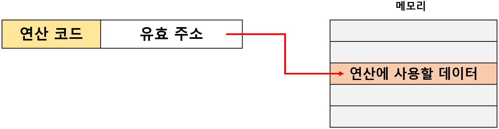
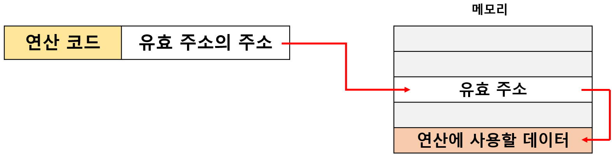
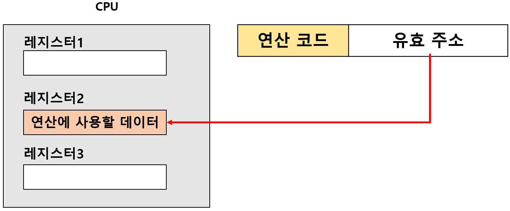
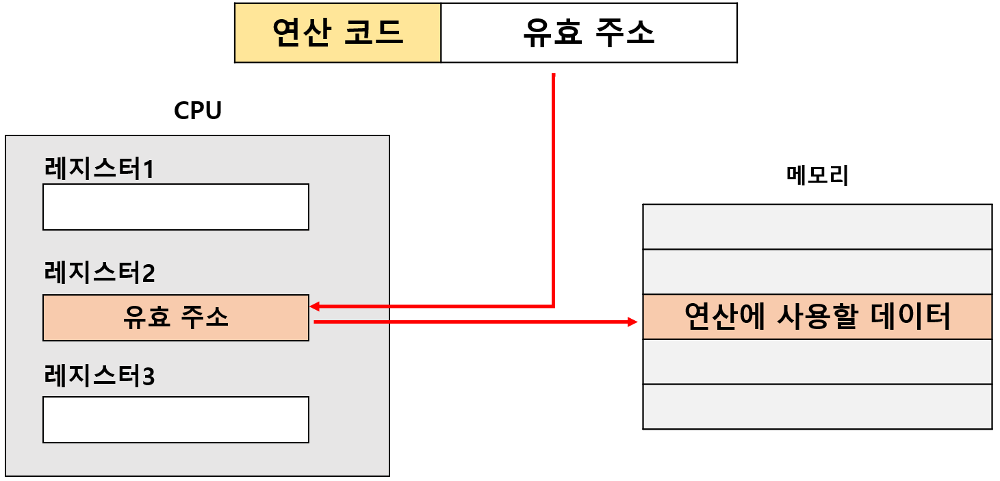
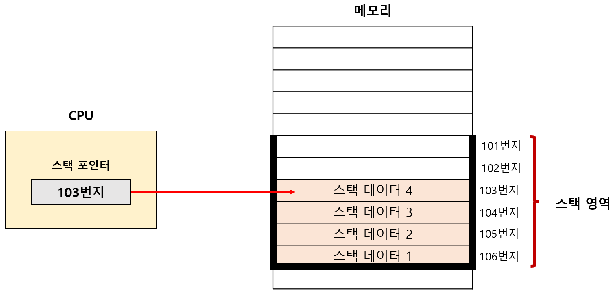
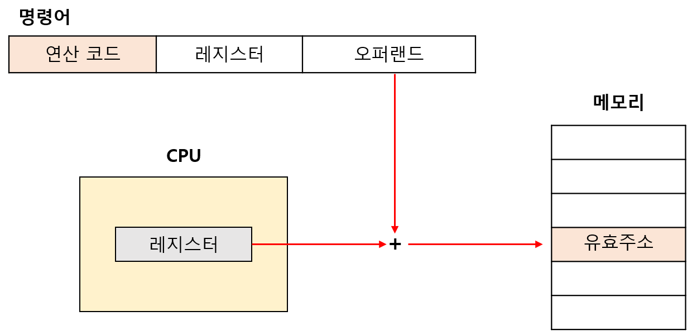
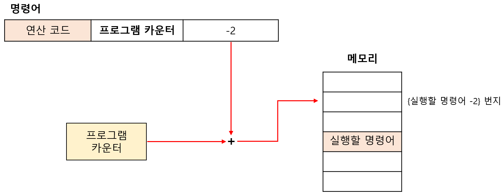
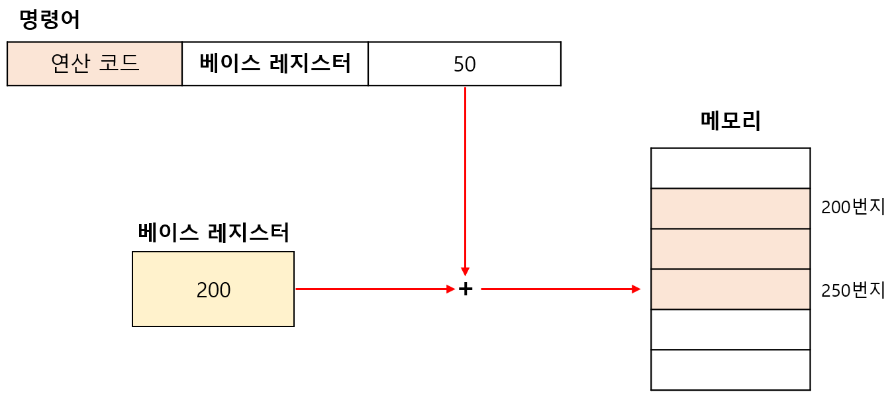

# 주소 지정 방식

## 00. 주소 지정 방식이란?

`유효 주소(effective address)`: 명령어에 사용할 데이터가 저장된 위치 

`주소 지정 방식(addressing mode)`: 유효 주소를 찾는 방법 

---

## 01. 즉시 주소 지정 방식(immediate addressing mode)

**특징**: 연산에 사용할 **데이터를 오퍼랜드 필드에 직접 명시**하는 방식 

**장점**: 연산에 사용할 데이터를 메모리나 레지스터로부터 찾는 과정이 없다 :arrow_right: 속도가 빠르다. 

**단점**: 표현할 수 있는 데이터의 크기가 작아진다. 

---

## 02. 직접 주소 지정 방식(direct addressing mode)

**특징**: 오퍼랜드 필드에 **유효 주소를 직접적으로 명시**하는 방식 

**장점**: 즉시 주소 지정 방식보다 표현할 수 있는 데이터의 크기가 크다. 

**단점**: 표현할 수 있는 유효 주소에 제한이 생길 수 있다. 

---

## 03. 간접 주소 지정 방식(indirect addressing mode)

**특징**: **유효 주소의 주소**를 오퍼랜드 필드에 명시하는 방식 

**장점**: 직접 주소 지정 방식보다 표현할 수 있는 유효주서의 범위가 크다. 

**단점**: 두 번의 메모리 접근이 필요 :arrow_right: 속도가 느린 편이다. 

---

## 04. 레지스터 주소 지정 방식(register addressing mode)

**특징**: 데이터를 저장할 **레지스터를 오퍼랜드 필드에 직접 명시**하는 방법 

**장점**: 레지스터(=CPU 내부)에 접근하는 것이 메모리(=CPU 외부)에 접근하는 것보다 속도가 더 빠르다. 

**단점**: 레지스터를 직접 명시 :arrow_right: 표현할 수 있는 레지스터의 크기에 제한이 생길 수 있다. 

---

## 05. 레지스터 간접 주소 지정 방식(register indirect addressing mode)

**특징**: **데이터를 메모리에 저장**하고, 그 **유효 주소를 저장한 레지스터를 오퍼랜드 필드에 명시**하는 방식 

**장점**: 메모리에 접근하는 횟수가 한 번으로 줄어든다 :arrow_right: 간접 주소 지정 방식의 속도 단점 보완 

---

## 06. 스택 주소 지정 방식(stack addressing mode)

**특징**: 스택의 `LIFO(후입선출)` 성질을 통해, 가장 최근에 저장한 값부터 꺼낼 수 있다. 

- 스택은 `메모리` 안에 스택처럼 사용할 공간인 **스택 영역**에 위치한다. 

- **스택 포인터**: 스택의 최상단을 가리키는 레지스터 

---

## 07. 변위 주소 지정 방식(displacement addressing mode)

**특징**: 오퍼랜드 필드의 값(=`변위`)과 특정 레지스터의 값을 더해 유효 주소를 얻어내는 방식 

**종류**: 상대 주소 지정 방식, 베이스 레지스터 지정 방식, 인덱스 주소 지정 방식, ... 

 

### i. 상대 주소 지정 방식(relative addressing mode)

**특징**: 오퍼랜드와 `프로그램 카운터`의 값을 더해 유효주소를 얻는 방식 

모든 코드를 실행하는 것이 아니라, 분기하여 특정 주소의 코드를 실행할 때 사용 

- 프로그램 카운터에는 읽어 들일 명령어의 주소가 저장되어 있다. 

- 오퍼랜드가 양수인 경우(+n) :arrow_right: 읽어 들이기로 한 명령어로부터 n번째 이후 번지로 접근 

- 오퍼랜드가 음수인 경우(-n) :arrow_right: 읽어 들이기로 한 명령어로부터 n번째 이전 번지로 접근 

 

### ii. 베이스 레지스터 주소 지정 방식(base-register addressing mode)

**특징**: 오퍼랜드와 `베이스 레지스터`의 값을 더하여 유효주소를 얻는 방식 

- 베이스 레지스터 = '기준 주소'의 역할 
- 오퍼랜드 = '기준 주소로부터 떨어진 거리'의 역할 

---

## 08. 주소 지정 방식에 따른 자료 접근 속도

1. 즉시 주소 지정 방식 

2. 레지스터 주소 지정 방식 

3. 직접 주소 지정 방식 

4. 레지스터 간접 주소 지정 방식 

5. 간접 주소 지정 방식 