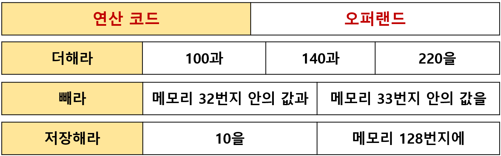
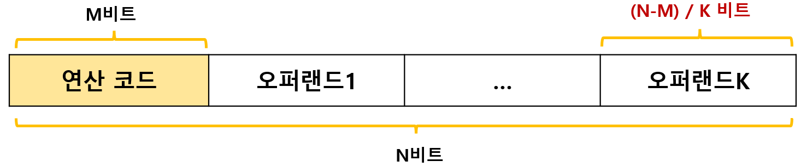

# 소스코드와 명령어

## 01. 고급 언어 vs 저급 언어

`고급 언어(high-level programming language)` 

- 사람이 이해하고 작성하기 쉽게 만들어진 언어 
- 우리가 아는 대부분의 프로그래밍 언어는 모두 고급 언어다. 
- 컴퓨터가 직접 이해하지 못한다. 

 

`저급 언어(low-level programming language)` 

- 컴퓨터가 직접 이해하고 실행할 수 있는 언어 
- 고급 언어로 작성한 코드는 반드시 저급 언어로 변환해줘야 한다. 
- 저급 언어에는 **기계어**와 **어셈블리어**가 있다. 
  - `기계어(machine code)`: 0과 1의 명령어 비트로 이루어진 언어 
  - `어셈블리어(assembly language)`: 기계어를 읽기 편한 형태로 번역한 저급 언어 

---

## 02. 컴파일 vs 인터프리터

고급 언어를 저급 언어로 `변환`하는 방법에는 두 가지가 있다. 

`컴파일(compile)` 방식 

- 소스 코드 `전체`가 저급 언어로 변환된다. 
- 실행 속도가 빠른 편이다. 
- 오류가 하나라도 발생할 경우, 컴파일이 중지된다. 
- 대표적인 컴파일 언어: C 

 

`인터프리터(interpreter)` 방식 

- 소스 코드가 `한 줄씩` 저급언어로 변환된다. 
- 컴파일 언어보다 실행 속도가 느린 편이다. 
- n번째 줄에 오류가 있어도, n-1번째 줄까지는 수행한다. 
- 대표적인 인터프리터 언어: Python 

---

## 03. 명령어의 구조

`명령어(instruction)` = 연산 코드 + 오퍼랜드 

---

## 04. 연산 코드

`연산 코드(operation code)`는 명령어가 수행할 연산이다. 

연산 코드 필드는 연산 코드가 담기는 영역을 의미한다. 

명령어의 종류와 생김새는 CPU마다 다르다 :arrow_right: 연산 코드의 종류와 생김새도 CPU마다 다르다. 

 

### I. 데이터 전송 연산 코드

- **MOVE**: 데이터를 옮겨라 
- **STORE**: 메모리에 저장하라 
- **LOAD (FETCH)**: 메모리에서 CPU로 데이터를 가져와라 
- **PUSH**: 스택에 데이터를 저장하라 
- **POP**: 스택의 최상단 데이터를 가져와라 

 

### II. 산술/논리 연산 코드

- **ADD, SUBTRACT, MULTIPLY, DEVIDE**: 덧셈, 뺄셈, 곱셈, 나눗셈을 수행하라 
- **INCREMENT, DECREMENT**: 오퍼랜드에 1을 더하라, 빼라 
- **AND, OR, NOT**: 논리 연산 AND, OR, NOT을 수행하라 
- **COMPARE**: 두 개의 숫자 또는 TRUE / FALSE 값을 비교하라 

 

### III. 제어 흐름 변경 연산 코드

- **JUMP**: 특정 주소로 실행 순서를 옮겨라 
- **CONDITIONAL JUMP**: 조건에 부합할 때, 특정 주소로 실행 순서를 옮겨라 
- **HALT**: 프로그램의 실행을 멈춰라 
- **RETURN**: CALL을 호출할 때 저장했던 주소로 돌아가라 

 

### IV. 입출력 제어 연산 코드

- **READ (INPUT)**: 특정 입출력 장치로부터 데이터를 읽어라 
- **WRITE (OUTPUT)**: 특정 입출력 장치로 데이터를 써라 
- **START IO**: 입출력 장치를 시작하라 
- **TEST IO**: 입출력 장치의 상태를 확인하라 

---

## 05. 오퍼랜드

`오퍼랜드(operand)`는 연산에 사용될 정보가 저장된 위치다. 

**오퍼랜드 필드**는 오퍼랜드가 담기는 영역이다 (=주소 필드) 

오퍼랜드가 n개인 명령어를 'n-주소 명령어'라고 한다. 

 

명령어의 길이가 제한됨 :arrow_right: 표현할 수 있는 데이터의 크기 제한 

명령어의 크기가 `N비트` 라고 하고 연산 코드의 크기가 `M비트`라고 하면, 오퍼랜드의 길이는 `N-M` 비트다. 

이 때 오퍼랜드가 `K개`라고 하면, 오퍼랜드 1개는 `(N-M)/K 비트`만 갖게 된다. 

따라서 보통 오퍼랜드 필드에 데이터 자체 보다는, 메모리의 주소나 레지스터의 이름을 넣는 경우가 많다. 

그렇게 되면, 메모리나 레지스터가 저장할 수 있는 공간만큼, 표현할 수 있는 데이터가 커진다. 

---