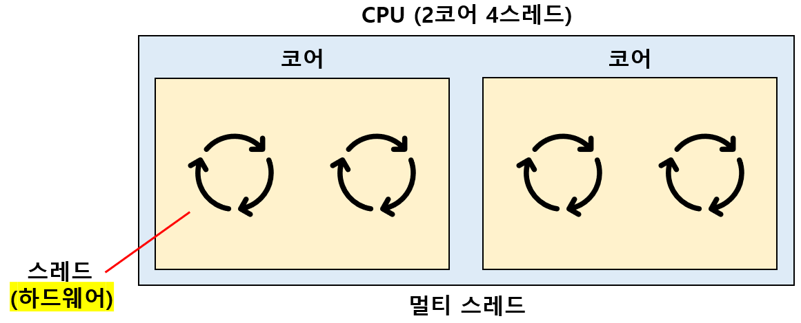
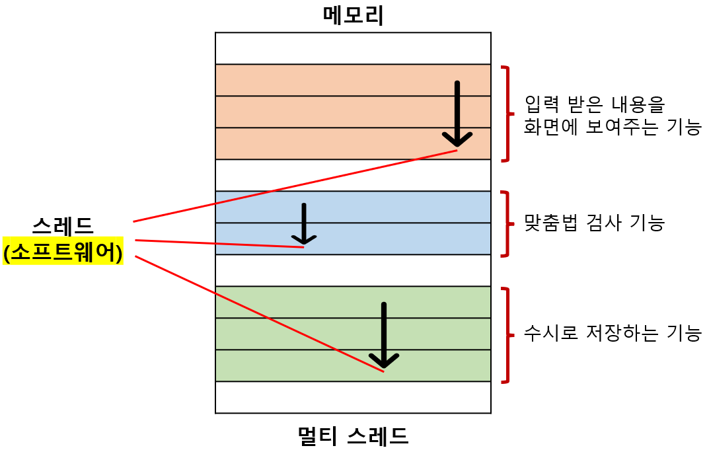

# 코어와 스레드

## 01. 클럭

`클럭(clock)`: 컴퓨터의 모든 부품이 맞춰서 작동하는 시간 단위 (단위: `Hz`) 

클럭 속도가 높다 :arrow_right: 클럭 신호가 빠르게 반복 :arrow_right: 명령어 사이클을 빠르게 반복 :arrow_right: CPU 성능이 좋다 

따라서 클럭 속도를 CPU 속도 단위로 간주하기도 한다. 

 

클럭 속도는 일정하지 않다.

실제로 CPU 속도를 확인하면 **기본(base) 클럭 속도**와 **최대(max) 클럭 속도**로 나눠져 있다. 

CPU가 고성능을 요구할 때 순간적으로 클럭 속도를 높이고, 반대의 경우에는 클럭 속도를 낮춘다. 

`오버클러킹(overclocking)`: 최대 클럭 속도를 강제로 더 끌어올리는 기법 

클럭 속도를 올리면 CPU가 더 빨라지기는 하지만, 장시간 사용시 발열 문제가 생긴다. 

즉, 클럭 속도만으로 CPU의 성능을 향상시키는 것에는 한계가 있다. 

---

## 02. 코어 & 멀티코어

전통적인 관점에서의 `CPU` = 명령어를 실행하는 부품으로, **원칙적으로 1개만 존재** 

기술의 발달로 CPU 내부에 '**명령어를 실행하는 부품**'을 여러 개 만들 수 있게 되었다. 

이로 인해, CPU 내부에서 명령어를 실행하는 부품을 `코어(core)`라고 부르고, 

이 코어들을 포함하는 부품을 CPU라고 재정의 하면서, 명칭의 범위가 확장되었다. 

 

`멀티코어(multi-core) 프로세서`: 코어를 여러 개 포함하고 있는 CPU 

일반적으로 멀티코어의 처리 속도가 단일코어보다 빠르다. (2.4GHz 단일코어 속도 < 1.9GHz의 멀티코어 속도) 

코어가 많을수록 CPU의 연산 속도가 증가하기는 하지만, 꼭 코어의 수에 비례해서 증가하지는 않는다. 

처리하고자 하는 작업량보다 코어 수가 지나치게 많아도 성능에는 크게 영향이 없다. 

중요한 것은 코어마다 처리할 명령어를 얼마나 적절하게 분배하는 것이다. 

---

## 03. 스레드

`스레드(thread)`: **실행 흐름의 단위** (사전적 의미) 

스레드는 프로그래밍 언어, CPU, 운영체제를 학습할 때 모두 등장하는 중요한 개념이다. 

하드웨어 스레드와 소프트웨어 스레드로 나뉜다. 

 

### I. 하드웨어 스레드

`하드웨어 스레드`: 하나의 코어가 동시에 처리하는 명령어 단위 

'**2코어 4스레드 CPU**'는 코어를 2개 포함하고, 한 번에 4개의 명령어를 처리할 수 있는 CPU를 의미한다. 

즉, 코어 하나당 2개의 하드웨어 스레드를 처리한다고 볼 수 있다. 

**컴퓨터 구조, CPU**에서 '스레드' 라는 용어는 보통 하드웨어 스레드를 의미한다. 

 

### II. 소프트웨어 스레드

`소프트웨어 스레드`: 하나의 프로그램에서 독립적으로 실행되는 단위 

하나의 프로그램은 실행되는 과정에서 여러 부분이 동시에 실행될 수도 있다. 

CPU와는 상관이 없어, 1코어 1스레드 CPU로도 여러 개의 소프트웨어 스레드를 실행할 수 있다. 

**프로그램, 운영체제**에서 사용되는 '스레드' 라는 용어는 보통 소프트웨어 스레드를 의미한다. 

---

## 04. 멀티스레드 프로세스

`멀티스레드(multi-thread) 프로세서`: 한 개의 코어로 명령어를 동시에 처리하는 CPU 

멀티스레드 프로세서의 핵심은 **레지스터**다. 

멀티스레드 프로세스 구현하기 위해서는 레지스터 세트를 여러 개 갖고 있어야 한다. 

**레지스터 세트**: 명령어를 처리하는 데 반드시 필요한 레지스터들 (프로그램 카운터, 데이터 버퍼 레지스터, 데이터 주소 레지스터, ...) 

`하이퍼 스레딩(hyper-threading)`: 인텔의 멀티스레드 기술 

 

2코어 4스레드 CPU는 한 번에 4개의 명령어를 처리할 수 있다. 

하지만 프로그램 입장에서는, 한 번에 한 개의 명령어를 처리하는 CPU가 4개 있는 것 처럼 보인다. 

따라서 **하드웨어 스레드**를 `논리 프로세서(logical proccessor)`라고 부르기도 한다. 

---

## 05. 마무리 용어 정리

`코어(core)`: 명령어를 실행할 수 있는 하드웨어 부품 

`스레드(thread)`: 명령어를 실행하는 단위 

- `하드웨어 스레드`: 하나의 코어가 동시에 처리하는 명령어 단위 
- `소프트웨어 스레드`: 하나의 프로그램에서 독립적으로 실행되는 단위 

`멀티코어 프로세서`: 2개 이상의 코어를 갖고있는 CPU 

`멀티스레드 프로세서`: 한 개의 코어로 여러 개의 명령어를 동시에 실행할 수 있는 CPU 

---