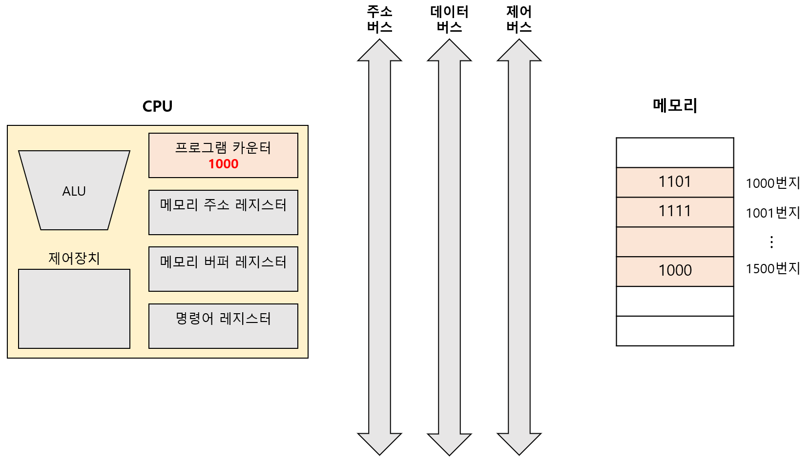
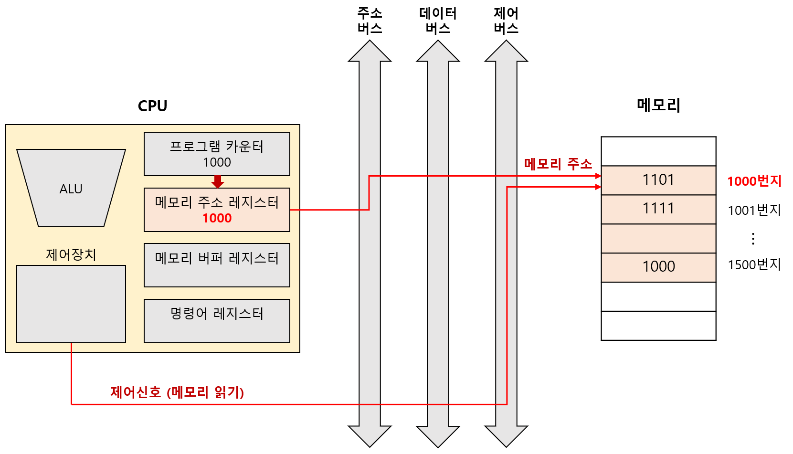
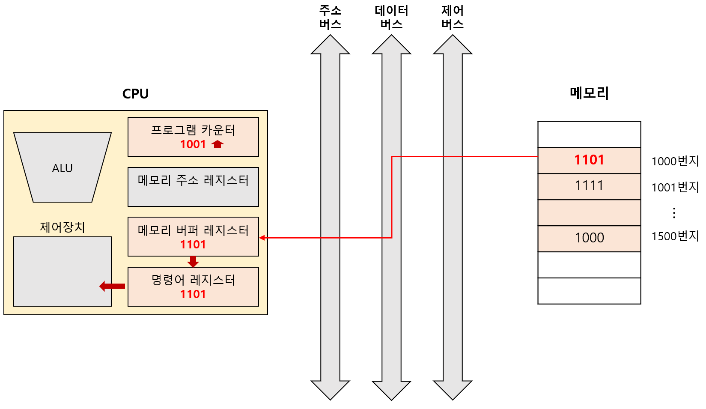

# 레지스터

## 01. 레지스터란?

`레지스터(register)`: CPU 내부의 작은 **임시 저장 장치** 

레지스터의 종류마다 하는 역할과 저장하는 내용이 다르다. 

사용화된 CPU마다 레지스터들의 이름, 크기, 종류가 매우 다양하다. 

---

## 02. 대표적인 레지스터

### I. 프로그램 카운터(Program Counter)

메모리에서 가져올 명령어의 주소를 저장하는 레지스터 

CPU의 종류에 따라 **명령어 포인터(Instruction Pointer)**라고도 한다. 

 

### II. 명령어 레지스터(Instruction Register)

메모리에 가져온 명령어를 저장하는 레지스터 

제어장치는 명령어 레지스터 속의 명렁어를 받고, 해석하고, 제어신호를 내보낸다. 

 

### III. 메모리 주소 레지스터(Memory Address Register)

메모리의 주소를 저장하는 레지스터 

CPU가 읽고자 하는 주소값을 주소 버스로 보낼 때, 메모리 주소 레지스터를 거친다. 

 

### IV. 메모리 버퍼 레지스터(Memory Buffer Register)

메모리와 주고받을 값(데이터, 명령어)을 저장하는 레지스터 

메모리에 쓰고 싶은 값이나, 전달 받은 값은 메모리 버퍼 레지스터를 거친다. 

CPU의 종류에 따라 **메모리 데이터 레지스터(Memory Data Register)** 라고도 한다. 

 

### V. 범용 레지스터(General Purpose Register)

이름 그대로, 다양하고 일반적인 상황에서 자유롭게 사용할 수 있는 레지스터 

메모리 버퍼 레지스터 :arrow_right: 데이터만 저장 

메모리 주소 레지스터 :arrow_right: 주소만 저장 

범용 레지스터 :arrow_right: 메모리와 주소 모두 저장 가능 

일반적으로 CPU에는 여러 개의 범용 레지스터들이 있다. 

 

### VI. 플래그 레지스터(Flag Register)

플래그를 저장하는 레지스터 

[플래그](./03-aluNcu.md#플래그flag)는 ALU의 연산 결과 또는 CPU 상태에 대한 부가 정보를 의미한다. 

 

### VII. 스택 포인터(Stack Pointer)

스택의 꼭대기를 가리키는 레지스터로, [스택 주소 지정 방식](./02-addressingMode.md#06-스택-주소-지정-방식stack-addressing-mode)에서 사용하는 레지스터 

 

### VIII. 베이스 레지스터(Base Register)

[베이스 레지스터 주소 지정 방식](./02-addressingMode.md#ii-베이스-레지스터-주소-지정-방식base-register-addressing-mode)에서 기준 주소로 사용하는 레지스터 

---

## 03. 프로그램 실행 과정 (레지스터 관점)

CPU로 실행할 프로그램이 메모리 1000번지부터 1500번지까지 저장되어 있다고 가정한다. 

프로그램을 실행하기 위해 `프로그램 카운터`에 1000이 저장된다. 

이는 메모리에서 가져올 명령어가 1000번지에 있다는 의미다. 

 

주소 버스로 1000번지를 내보내기 위해, `메모리 주소 레지스터`에 1000이 저장된다. 

`제어 버스`를 통해 **'메모리 읽기' 제어신호**가 메모리로 보내진다. 

`주소 버스`를 통해 **메모리 주소 레지스터 값**이 메모리로 보내진다. 

 

`데이터 버스`를 통해 메모리 1000번지에 저장된 값이 `메모리 버퍼 레지스터`로 전달된다. 

`프로그램 카운터`는 증가하여 다음 명령어를 읽어들일 준비를 한다. 

그리고 메모리 버퍼 레지스터에 저장된 값은 `명령어 레지스터`로 이동한다. 

`제어장치`는 명령어 레지스터의 명령어를 해석하고, 제어신호를 발생시킨다. 

 

프로그램 카운터는 지속적으로 증가해, 계속해서 다음 명령어를 읽어 들일 준비를 한다. 

이 과정이 반복되며 CPU는 프로그램을 순차적으로 실행해 나간다. 

특정 메모리 주소로 실행 흐름을 이동하는 명령어(JUMP, CALL, RET, ...)나 인터럽트가 발생하면 순차적인 실행 흐름이 끊긴다. 

---