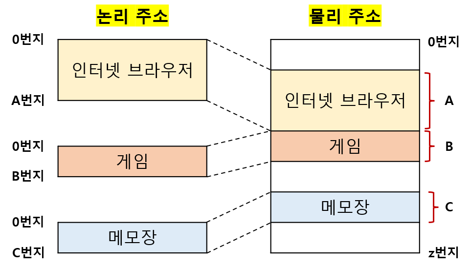
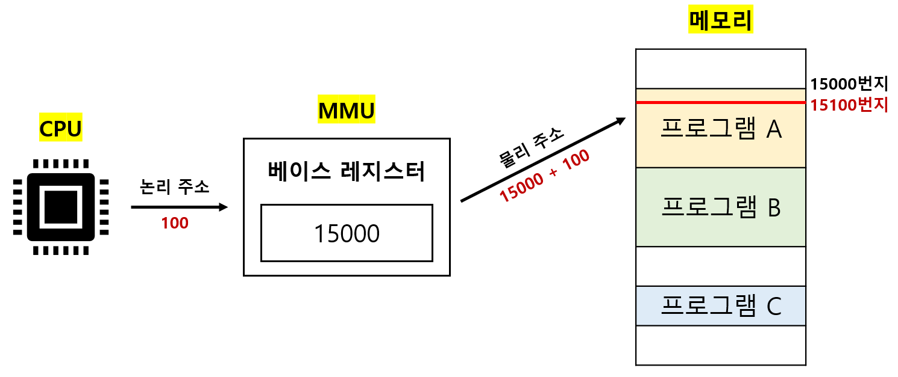
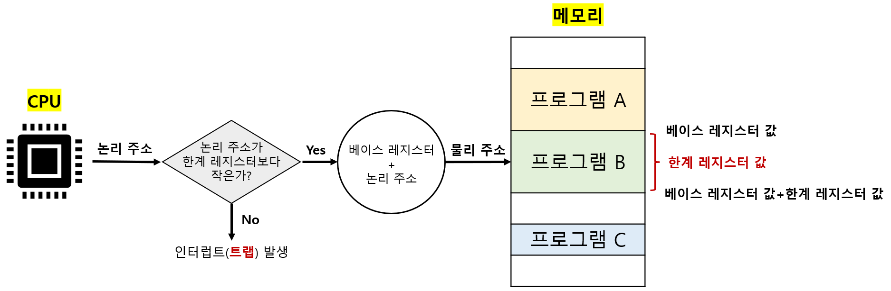

# 메모리의 주소 공간

## 01. 물리 주소 & 논리 주소

### I. 물리 주소(physical address)

- 메모리 하드웨어가 사용하는 주소 

- 정보가 실제로 저장된 하드웨어상의 주소를 의미 

 

### II. 논리 주소(logical address)

- CPU와 실행 중인 프로그램이 사용하는 주소 

- 실행 중인 프로그램 각각에게 부여된 0번지부터 시작되는 주소를 의미 

 

### III. 메모리 관리 장치(Memory Management Unit, MMU)

논리 주소를 물리 주소로 변환할 때 사용하는 하드웨어다. 

- 베이스 레지스터에 프로그램의 시작점에 해당하는 물리 주소를 저장한다. 

- 논리 주소는 프로그램의 시작점으로부터 떨어진 거리를 의미한다. 

- 베이스 레지스터와 논리 주소를 합해 물리 주소에 접근한다. 

---

## 02. 메모리 보호 기법

논리 주소 > 접근하고 싶은 프로그램의 크기 :arrow_right: 의도치 않은 프로그램에 접근 

따라서 의도치 않은 프로그램에 접근하는 것을 방지하기 위해 `한계 레지스터`를 사용한다. 

`한계 레지스터(limit register)`에는 논리 주소의 최대 크기(=프로그램이 차지하는 메모리 크기)를 저장한다. 

베이스 레지스터 값 <= 프로그램의 물리 주소 <= (베이스 레지스터 값 + 한계 레지스터 값)

만약 논리주소가 한계 레지스터보다 크면 `인터럽트(트랩)`을 발생시켜 실행을 중단한다. 

---
