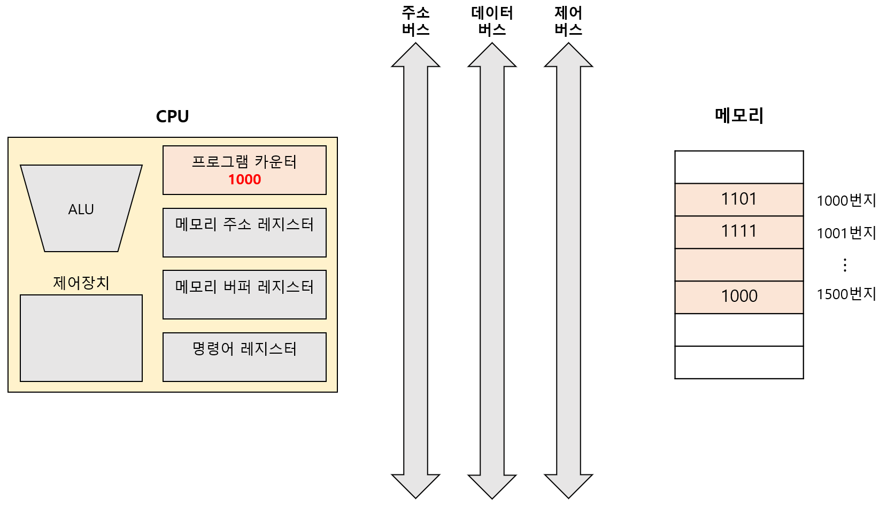
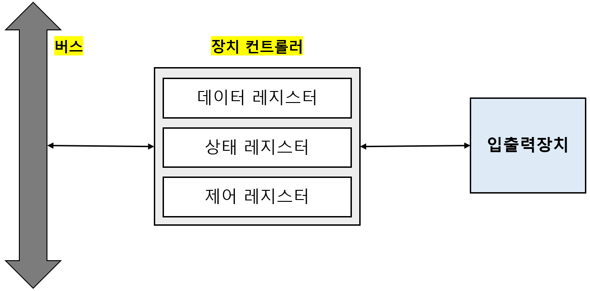
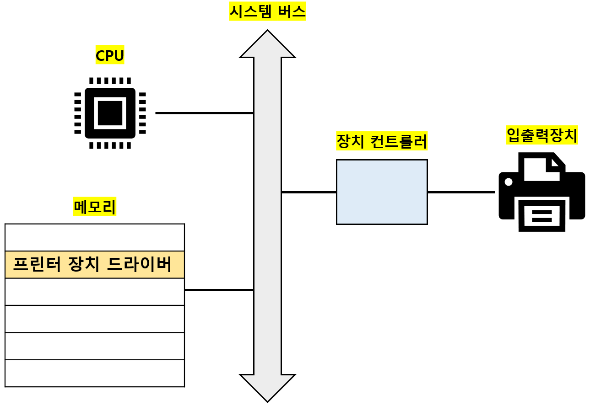

# 장치 컨트롤러 & 장치 드라이버

## 01. 입출력장치(I/O device)

`입출력장치`: 컴퓨터 외부와 연결되어, 컴퓨터 내부와 정보를 교환하는 장치 

대표적인 입출력장치에는 마이크, 스피커, 프린터, 마우스, 키보드 등이 있다. 

컴퓨터 외부에 연결되는 `주변장치`의 개념으로 보면 보조기억장치도 입출력장치에 포함된다고 볼 수도 있다. 

---

## 02. 장치 컨트롤러(device controller)

### I. 입출력장치는 다루기 어렵다

1. 입출력장치의 종류가 너무 많다 :arrow_right: 정보를 주고받는 방식을 규격화하기 어렵다. 
2. CPU와 메모리의 데이터 전송률은 높지만, 입출력장치의 데이터 전송률은 낮다. 

 

### II. 장치 컨트롤러의 역할

`장치 컨트롤러`: 컴퓨터와 입출력장치를 연결해주는 하드웨어 (=입출력 제어기, 입출력 모듈) 

- CPU와 입출력장치 사이에 통신 중개 :arrow_right: 규격화 문제를 해결 (일종의 번역가 역할) 

- 연결된 입출력장치에 문제가 없는지 오류를 검출 

- `데이터 버퍼링`: 버퍼에 데이터를 모았다가 내보내는 속도를 조절해, 전송률 차이를 완화하는 방식  
  - `버퍼(buffer)`: 데이터를 저장하는 임시 저장 공간 
  - `버퍼링(buffering)`: 버퍼를 통해 전송률의 차이가 나는 두 장치의 전송률을 비슷하게 맞추는 방법 

 

### III. 장치 컨트롤러의 구조

- `데이터 레지스터`: CPU와 입출력장치 사이에 주고받을 데이터가 담기는 레지스터 (버퍼 역할) 

- `상태 레지스터`: 입출력장치의 상태 정보를 저장 (작업 준비, 작업 완료, 오류 유무) 

- `제어 레지스터`: 입출력장치가 수행할 내용에 대한 제어 정보와 명령을 저장 

---

## 03. 장치 드라이버(device driver)

`장치 드라이버`: 장치 컨트롤러가 컴퓨터 내부와 정보를 주고받을 수 있게 하는 프로그램 

프로그램이기 때문에 실행과정에서 메모리에 저장된다. 

 

장치 컨트롤러 :arrow_right: 입출력장치를 연결하기 위한 `하드웨어`적인 통로 

장치 드라이버 :arrow_right: 입출력장치를 연결하기 위한 `소프트웨어`적인 통로 

---