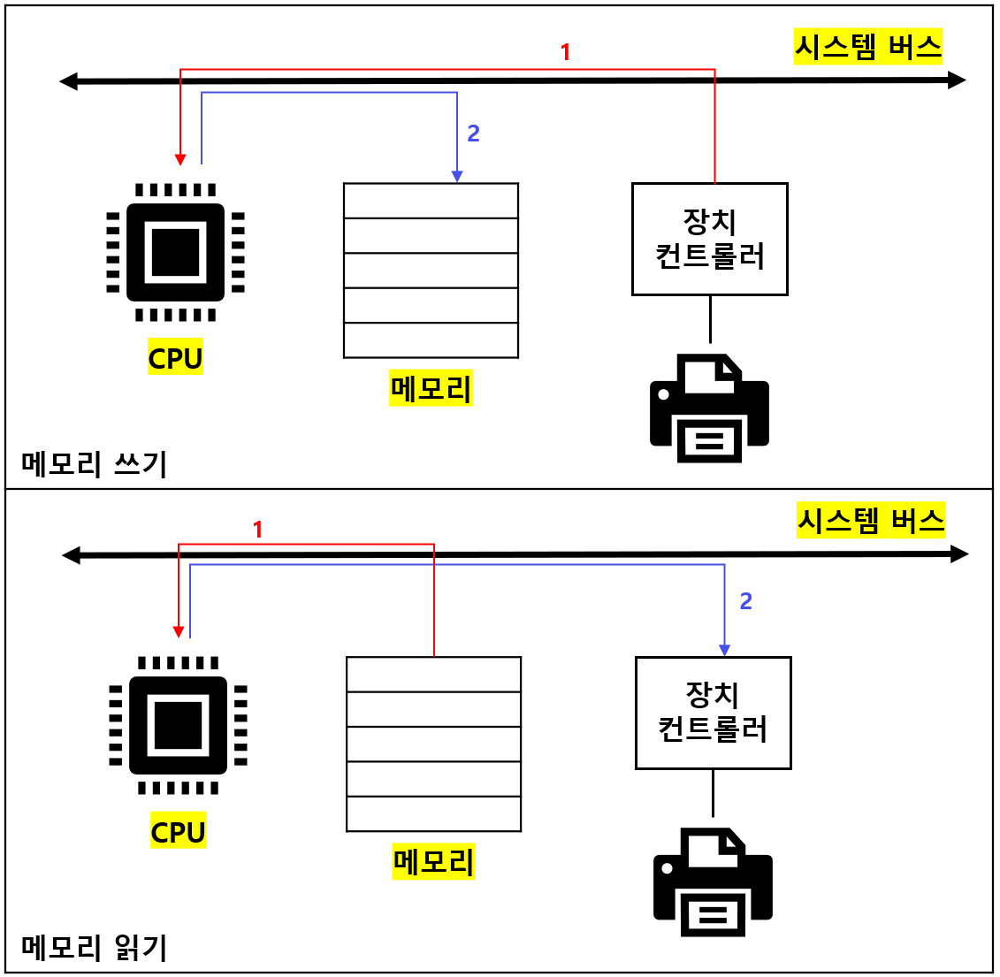
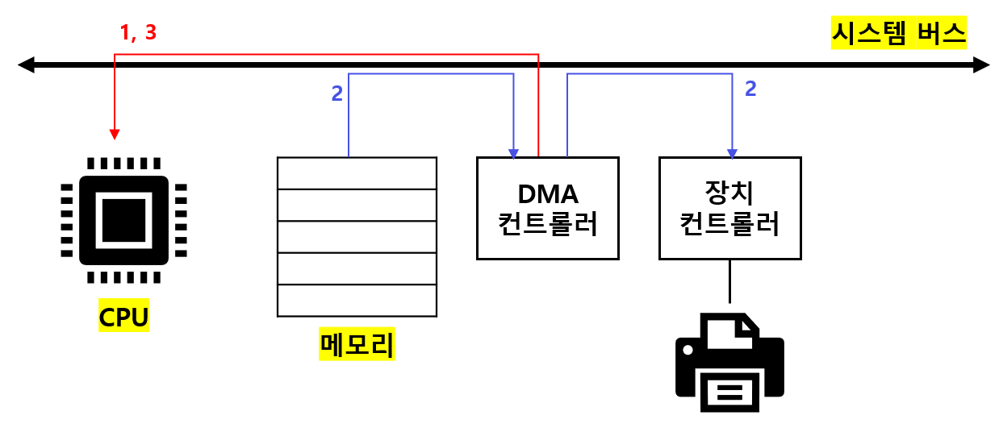
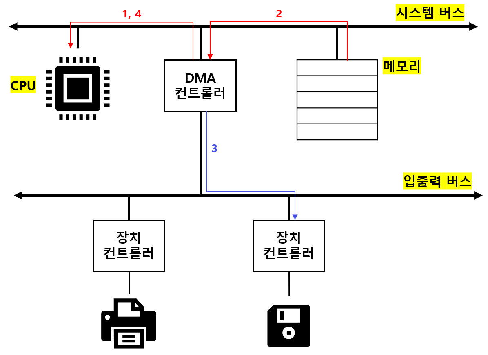

# 다양한 입출력 방법

## 01. 프로그램 입출력 (programmed I/O)

### I. 기본 개념

`프로그램 입출력`: 기본적으로 프로그램 속 명령어로 입출력장치를 제어하는 방법 

1. CPU는 장치 컨트롤러의 제어 레지스터에 쓰기 명령을 보낸다. 

2. 장치 컨트롤러는 상태 레지스터의 상태를 확인한다. 

3. 준비가 되면 메모리의 정보를 데이터 레지스터에 쓴다. 

CPU는 `외부`에 있는 장치 컨트롤러 속 레지스터들을 알기 어렵다. 

따라서 '메모리 맵 입출력'과 '고립형 입출력' 방식을 사용해 장치 컨트롤러 속 레지스터를 파악한다. 

 

### II. 메모리 맵 입출력 (memory-mapped I/O) 

메모리에 위한 주소 공간과 입출력장치를 위한 주소 공간을 하나의 공간으로 간주하는 방법 

- 1024개의 주소 공간이 있을 때 512개는 메모리 주소를, 512개는 장치 컨트롤러의 레지스터를 표현 

- 메모리와 입출력장치에 같은 명령어를 사용할 수 있는 장점이 있다. 

- 메모리의 주소 공간이 축소된다는 단점이 있다. 

 

### III. 고립형 입출력 (isolated I/O)

메모리를 위한 주소 공간과 입출력장치를 위한 주소 공간을 분리하는 방법 

- 1024개의 주소 공간이 있을 때 메모리와 입출력장치 모두 1024개의 주소 공간을 활용할 수 있다. 

- `제어버스`에 '메모리 선'과 '입출력장치 선'이 따로 있기 때문이다. 

- 메모리의 주소 공간이 축소되지 않는다는 장점이 있다. 

- 입출력 전용 명령어를 사용해야 된다는 단점이 있다. 

---

## 02. 인터럽트 기반 입출력 (Interrupt-Driven I/O)

### I. 기본 개념

`인터럽트 기반 입출력`: 인터럽트를 기반으로 하는 입출력 

정확히 말하면, 인터럽트는 입출력장치가 아니라 장치 컨트롤러에 의해 발생한다. 

1. CPU가 입출력 장치에게 작업을 명령한다. 

2. 입출력장치가 작업을 수행하는 동안, CPU는 다른 작업을 한다. 

3. 입출력 작업이 끝나면, 장치 컨트롤러가 CPU에게 인터럽트 요청 신호를 보낸다. 

4. CPU는 하던 일을 백업하고, 인터럽트 서비스 루틴을 실행한다. 

 

### II. 인터럽트 vs 폴링

`폴링(poliing)`: CPU가 인터럽트를 받지 않고, 주기적으로 장치 컨트롤러를 확인하는 방식 

주기적으로 장치 컨트롤러의 상태 레지스터를 확인해야 하기 때문에 CPU의 부담이 크다. 

따라서 인터럽트 기반 입출력 방식을 사용하는 것이 더 효율적이다. 

 

### III. 다중 인터럽트 처리

인터럽트의 우선순위가 상관 없는 경우, 순서대로 인터럽트 서비스 루틴을 실행한다. 

인터럽트 처리 중 우선 순위가 더 큰 인터럽트가 발생한 경우, 우선 순위가 높은 인터럽트부터 처리한다. 

막을 수 없는 인터럽트(`NMI`: Non-Maskable Interrupt)가 발생한 경우에도 우선 순위가 높은 인터럽트부터 처리한다. 

 

### IV. PIC (Programmable Interrupt Controller)

`PIC`는 여러 장치 컨트롤러에 연결되어 하드웨어 인터럽트 요청의 우선 순위를 판별하고, 

CPU에게 지금 처리해야 할 하드웨어 인터럽트는 무엇인지 알려주는 하드웨어다. 

PIC는 인터럽트 비트를 통해 막을 수 있는 하드웨어 인터럽트의 우선순위만 판별 (NMI는 판별 X) 

1. PIC가 장치 컨트롤러에서 `인터럽트 요청 신호`를 받아들인다. 

2. PIC는 인터럽트 우선순위를 판단하고, CPU에게 `인터럽트 요청 신호`를 보낸다. 

3. CPU는 PIC에게 인터럽트 확인 신호를 보낸다. 

4. PIC는 데이터 버스를 통해 CPU에게 `인터럽트 벡터`를 보낸다. 

5. CPU는 해당 장치의 `인터럽트 서비스 루틴`을 실행한다. 

---

## 03. DMA 입출력 (Direct Memory Access)

### I. 다른 입출력 방식의 경우

`프로그램 입출력`과 `인터럽트 기반 입출력`의 경우, 이동하는 데이터는 반드시 CPU를 거친다. 

CPU는 입출력장치를 위한 연산 때문에 시간을 뺐겨, 대용량 데이터의 경우 부담이 간다. 

 

### II. DMA 입출력

`DMA 입출력`: 입출력장치와 메모리가 CPU를 거치지 않고도 상호작용할 수 있는 입출력 방식 

DMA 입출력이 가능하기 위해서는 `DMA 컨트롤러`라는 하드웨어가 필요하다. (시스템 버스에 연결) 

1. CPU는 DMA 컨트롤러에게 정보를 주며(메모리와 하드디스크 주소, 수행할 명령 등) 입출력 작업을 명령 

2. DMA 컨트롤러는 CPU를 거치지 않고 메모리와 직접 상호작용 후, 장치 컨트롤러에게 전달 

3. 작업이 끝나면, DMA 컨트롤러는 CPU에게 인터럽트를 전송해 작업이 끝남을 알림 

 

CPU는 시작(정보 전달)과 끝(인터럽트 받기)에만 관여하면 된다. :arrow_right: 작업 부담 감소 

시스템 버스는 공용 자원이기 때문에 동시에 사용이 불가능 :arrow_right: DMA 컨트롤러와 CPU 번갈아 사용 

`사이클 스틸링(cycle stealing)`: DMA 컨트롤러가 일시적으로 CPU 대신 시스템 버스를 이용하는 것 

 

### III. 입출력 버스(I/O bus)

DMA를 위해 시스템 버스를 자주 사용 :arrow_right: 그만큼 CPU가 시스템 버스를 이용하지 못한다. 

이 문제를 해결하기 위해, `입출력 버스`라는 별도의 버스에 연결하여 사용 

현재 대부분의 입출력장치들은 시스템 버스가 아니라, 입출력 버스와 연결된다. 

입출력 버스에는 `PCI 버스`, `PCIe 버스` 등 여러 종류가 있다. 

---
