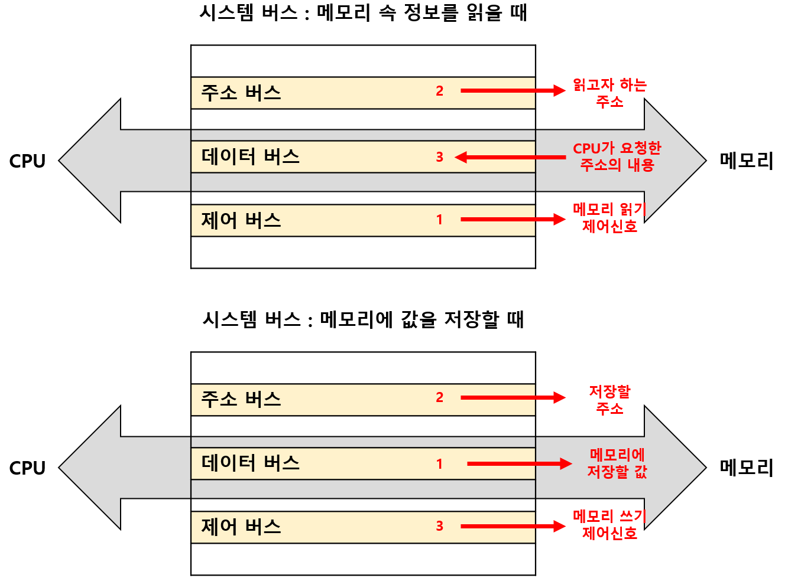

# 컴퓨터 구조 도입

## 01. Intro.

컴퓨터 구조를 알면, 프로그래밍 언어의 문법만으로는 알기 어려운 `성능`, `용량`, `비용`을 고려하며 개발할 수 있다. 

우리가 알아야 할 컴퓨터 구조 지식은 크게 두 가지다. 

### I. 컴퓨터가 이해하는 정보

- `데이터(data)`는 컴퓨터가 이해하는 숫자, 문자, 이미지, 동영상과 같은 정적인 정보다. 
- `명령어(instruction)`는 데이터를 움직이고, 컴퓨터를 작동시키는 정보다. 

### II. 컴퓨터의 4가지 핵심 부품

- `중앙처리장치(CPU)`는 메모리에 저장된 정보를 읽고, 해석하고, 실행하는 부품이다. 
- `주기억장치(memory)`는 현재 실행되는 프로그램의 명령어와 데이터를 저장하는 부품이다. 
- `보조기억장치`는 전원이 꺼져도 보관할 프로그램을 저장하는 부품이다. 
- `입출력장치`는 컴퓨터 외부와 내부의 정보를 교환할 수 있는 부품이다. 

---

## 02. 컴퓨터 구조의 큰 그림

### I. 주기억장치(main memory)

`주기억장치(main memory)`는 현재 실행되는 프로그램의 명령어와 데이터를 저장하는 부품이다. 

따라서 프로그램이 실행되기 위해서는 반드시 주기억장치에 저장되어 있어야 한다. 

주기억장치는 `메모리(memory)`라고도 한다. 

컴퓨터의 속도와 효율을 위해, 저장된 정보의 위치는 주소(address)라는 개념을 사용하여 정돈된다. 

주소를 통해 메모리에 저장된 값의 위치에 접근할 수 있다. 

 

### II. 중앙처리장치(Central Processing Unit, CPU)

`중앙처리장치(CPU)`는 저장된 정보를 읽고, 해석하고, 실행하는 부품이다. 

내부 구성요소로는 산술논리연산장치(ALU), 레지스터, 제어장치가 있다. 

- `산술논리연산장치(ALU)`는 컴퓨터 내부에서 수행되는 대부분의 계산을 한다. 
- `레지스터`는 CPU 내부의 작은 임시 저장장치다. 
- `제어장치`는 **제어신호**를 내보내고, 명령어를 해석하는 장치다. 
  - CPU가 메모리에 저장된 값을 읽고 싶다 :arrow_right: '메모리 읽기' 제어신호 전송
  - CPU가 메모리에 어떤 값을 저장하고 싶다 :arrow_right: '메모리 쓰기' 제어신호 전송

 

### III. 보조기억장치

주기억장치에는 치명적인 단점 두 가지가 있다. 

1. 가격이 비싸 저장 용량이 적다. 
2. 전원이 꺼지면 저장된 내용을 잃는다. 

`보조기억장치(secondary storage)`는 이러한 주기억장치의 단점을 보조하는 저장장치다. 

주기억장치가 현재 실행되는 프로그램을 저장한다면, 보조기억장치는 **보관할** 프로그램을 저장한다. 

보조기억장치의 종류로는 하드디스크, USB, DVD, CD-ROM 등이 있다. 

 

### IV. 입출력장치

`입출력장치(Input Output device)`는 컴퓨터와 연결되어, 컴퓨터 내부와 정보를 교환하는 장치다. 

대표적인 입출력장치에는 마이크, 스피커, 프린터, 마우스, 키보드 등이 있다. 

 

### V. 메인보드

컴퓨터의 핵심 부품들은 모두 `메인보드(main board)`라는 판에 연결된다. 

메인보드에는 여러 컴퓨터 부품들을 부착할 수 있는 슬롯과 연결 단자가 있다. 

 

### VI. 시스템 버스

`시스템 버스(system bus)`는 컴퓨터의 4가지 핵심 부품들을 연결하는 가장 중요한 버스다. 

시스템 버스의 내부 구성은 다음과 같다. 

- `주소 버스(address bus)`는 주소를 주고받는 통로다. 
- `데이터 버스(data bus)`는 명령어와 데이터를 주고받는 통로다. 
- `제어 버스(control bus)`는 제어신호를 주고받는 통로다. 

---
