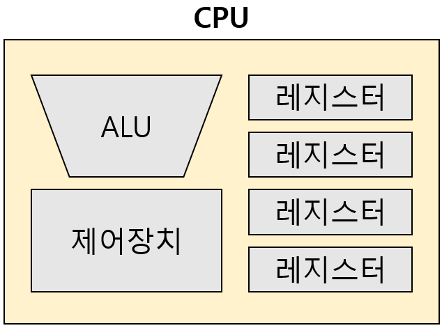
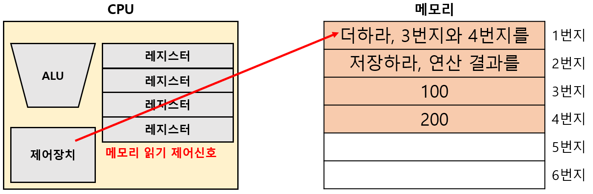

# ALU와 제어장치

## 01. CPU의 구조

`CPU(Central Processing Unit)`: 메모리에 저장된 명령어를 읽고, 해석하고, 실행하는 장치 

CPU는 다음과 같이 구성된다. 

- **ALU**: 계산 담당 
- **제어장치**: 명령어를 읽어들이고 해석 
- **레지스터**: 임시 저장 장치 

---

## 02. CPU의 명령어 처리 과정

제어장치는 1번지의 저장된 명령어를 읽기 위해 메모리에 '메모리 읽기' 제어신호를 보낸다. 

 

메모리는 1번지에 저장된 명령어를 CPU에 건네주고, 이것은 레지스터에 저장된다. 

제어장치는 명령어를 해석한다. 

제어장치는 3번지, 4번지에 저장된 데이터를 읽기 위해 메모리에 '메모리 읽기' 제어신호를 보낸다. 

 

메모리는 3,4번지에 저장된 데이터를 CPU에 건네주고, 이것은 서로 다른 레지스터에 저장된다. 

ALU는 읽어 들인 데이터로 연산을 수행한다. 

계산의 결과값은 레지스터에 저장된다. 

 

제어장치는 2번지에 저장된 명령어를 읽기 위해 메모리에 '메모리 읽기' 제어신호를 보낸다. 

메모리는 2번지에 저장된 명령어를 CPU에 건네주고, 이것은 레지스터에 저장된다. 

제어장치는 명령어를 해석한다. 

 

제어장치는 계산 결과를 저장하기 위해 메모리에 '메모리 쓰기' 제어신호와 결과값을 보낸다. 

---

## 03. ALU

`ALU(Arithmetic Logic Unit)`: 컴퓨터 내부에서 대부분의 계산을 수행하는 장치 

ALU는 레지스터를 통해 피연산자를 받아들인다. 

ALU는 제어장치로부터 수행할 연산을 알려주는 제어신호를 받아들인다. 

ALU가 연산을 수행한 결과값은 메모리에 바로 저장되지 않고, 레지스터에 저장된다. (CPU가 메모리에 접근하는 속도가 CPU가 레지스터에 접근하는 속도보다 매우 느리기 때문) 

ALU는 계산 결과와 더불어, 결과에 대한 추가적인 상태 정보인 `플래그(flag)`를 내보낸다. 

 

### 플래그(flag)

`플래그(flag)`: ALU의 연산 결과에 대한 추가적인 상태정보 

- **부호 플래그**: 연간 결과의 부호를 표현 
  - 0 = 양수 
  - 1 = 음수 

- **제로 플래그**: 연산 결과가 0인지 여부를 표현 
  - 0 = 계산결과가 0 
  - 1 = 계산결과가 0이 아님 

- **캐리 플래그**: 연산 결과 올림수나 빌림수의 발생 여부를 표현 
  - 0 = 올림수나 빌림수 발생X
  - 1 = 올림수나 빌림수 발생O

- **오버플로우 플래그**: 오버플로우 발생 여부를 표현 
  - 0 = 오버플로우 발생X
  - 1 = 오버플로우 발생O

- **인터럽트 플래그**: 인터럽트가 가능한지 표현 
  - 0 = 인터럽트 불가능
  - 1 = 인터럽트 가능

- **슈퍼바이저 플래그**: 커널 모드인지 사용자 모드로 실행중인지 표현 
  - 0 = 사용자 모드
  - 1 = 커널 모드

 

이 밖에도 ALU 내부에는 다양한 계산을 위한 회로들이 있다. 

- **가산기**: 덧셈을 수행하는 회로 
- **보수기**: 뺄셈을 수행하는 회로 
- **시프터**: 시프트 연산을 수행하는 회로 
- **오버플로우 검출기**: 오버플로우를 대비하는 회로 

---

## 04. 제어장치

`제어장치(Control Unit)`: 제어신호를 내보내고, 명령어를 해석하는 부품 

제어장치는 **클럭 신호, 해석할 명령어, 플래그, 제어신호**를 받아들인다. 

- `클럭(clock)`: 컴퓨터의 모든 부품이 맞춰서 작동하는 **시간 단위** 

- CPU가 해석할 명령어는 **명령어 레지스터**에 저장돼있다. 

- 제어신호는 CPU 뿐만 아니라, **입출력 장치와 보조기억장치**에서도 발생시킬 수 있다. 

 

제어장치가 내보내는 제어신호를 크게 두 가지로 나눌 수 있다. 

`CPU 내부에 전달하는 제어신호`는 레지스터나 ALU에게 전달된다. 

- ALU에게는 수행할 연산을 지시하기 위해 제어신호를 내보낸다. 
- 레지스터에게는 데이터를 이동시키거나, 저장된 명령어를 해석하기 위해 제어신호를 보낸다. 

`CPU 외부에 전달하는 제어신호`는 메모리, 보조기억장치, 입출력장치에게 전달된다. 

- CPU 외부로 전달되는 제어신호는 `제어 버스`를 통해 전달된다. 
- 메모리에게는 저장될 값을 읽거나, 새로운 값을 쓰고 싶을 때 제어신호를 보낸다. 
- 보조기억장치나 입출력 장치에게도 저장된 값을 읽거나, 새로운 값을 쓰고 싶을 때 제어신호를 보낸다. 