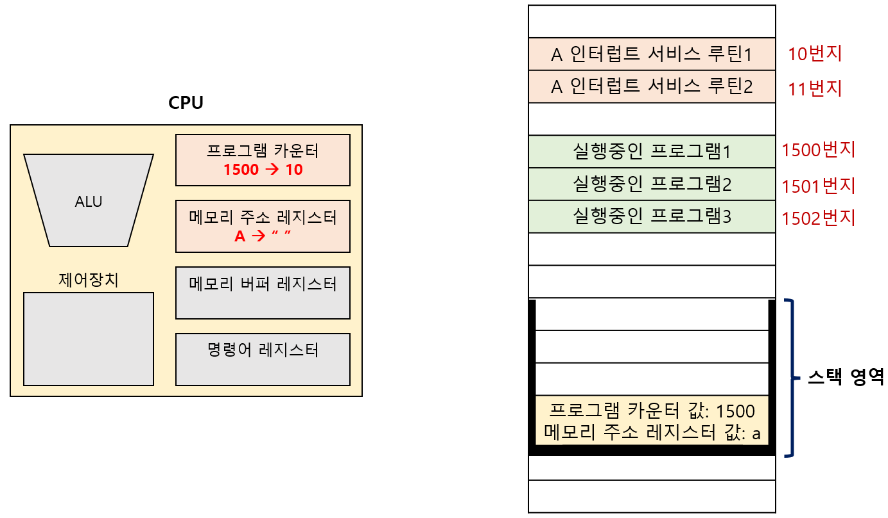

# 명령어 사이클과 인터럽트

## 01. 명령어 사이클

`명령어 사이클(instruction cycle)`:  명령어들이 일정하게 반복하며 실행되는 주기 

프로그램 속 명령어들은 명령어 사이클을 반복하며, 명령어들을 순차적으로 실행한다. 

- `인출 사이클(fetch cycle)`: 메모리에 있는 명령어를 CPU로 갖고 오는 단계 

- `실행 사이클(execution cycle)`: CPU로 불러온 명령어를 실행하는 단계 

- `간접 사이클(indirect cycle)`: 메모리 접근을 한 번 더 해야하는 단계 (ex: 간접 주소 지정 방식) 

- `인터럽트 사이클(interrupt cycle)`: 인터럽트를 수행하는 단계 

---

## 02. 인터럽트

`인터럽트(interrupt)`: CPU의 정상적인 작업을 방해하는 신호 

- `동기 인터럽트`: 주로 **CPU**에 의해 발생하는 인터럽트 

- `비동기 인터럽트`: 주로 **입출력장치**에 의해 발생하는 인터럽트 

---

## 03. 동기 인터럽트 (=예외)

### I. 동기 인터럽트

`동기 인터럽트(synchronous interrupt)`: CPU에 의해 발생하는 인터럽트 

CPU가 명령어들을 수행하다가 예상치 못한 상황에 마주치면 발생 (ex: 프로그래밍 상의 오류) 

이런 점에서 동기 인터럽트는 `예외(exception)`이라고도 자주 부른다. 

예외가 발생하면, CPU는 하던 작업을 중지하고 해당 예외를 처리한다. 

예외를 처리하면, CPU는 본래 하던 작업으로 돌아와 실행을 재개한다. 

 

### II. 예외의 종류

- `폴트(fault)`: 예외를 처리한 직후, 예외가 발생한 명령어부터 실행을 재개하는 예외 

- `트랩(trap)`: 예외를 처리한 직후, 예외가 발생한 명령어의 다음 명령어부터 실행을 재개하는 예외 

- `중단(abort)`: 실행 중인 프로그램을 강제로 중단시킬 수 밖에 없는 심각한 오류를 발견했을 때 발생 

- `소프트웨어 인터럽트(software interrupt)`: 시스템 호출이 발생했을 때 발생하는 예외 

---

## 04. 비동기 인터럽트 (=하드웨어 인터럽트)

### I. 비동기 인터럽트

`비동기 인터럽트(asynchronous interrupt)`: 주로 입출력장치에 의해 발생하는 인터럽트 

입출력장치가 어떤 입력을 받았을 때, 이를 처리하기 위해 CPU에게 보내는 인터럽트다. 

입출력장치는 CPU에 비해 실행 속도가 매우 느리기 때문에 비동기 인터럽트를 통해 CPU가 입출력 작업 도중에도 효율적으로 작업할 수 있다. 

일반적으로 비동기 인터럽트를 `인터럽트` 또는 `하드웨어 인터럽트`라고 한다. 

 

### II. 인터럽트 플래그

`인터럽트 플래그`: 하드웨어 인터럽트를 받아들일지, 무시할지 결정하는 플래그 (0: 불가능, 1: 가능) 

인터럽트 플래그가 활성화 되어 있어야, CPU는 인터럽트 요청을 수용할 수 있다. 

인터럽트 플래그로도 막을 수 없는, 우선 순위가 높은 인터럽트도 존재한다. (ex: 정전, 하드웨어 고장) 

---

## 05. 비동기 인터럽트 처리과정

입출력 장치는 CPU에게 `인터럽트 요청 신호`를 보낸다. 

CPU는 실행 사이클이 끝나고, 명령어를 인출하기 전 항상 인터럽트 여부를 확인한다. 

CPU는 인터럽트 요청을 확인하고, `인터럽트 플래그`를 통해 인터럽트 처리 가능 여부를 확인한다. 

인터럽트를 처리할 수 있다면, CPU는 지금까지의 작업을 **스택에 백업**한다. 

 

그리고 CPU는 **인터럽트 벡터**를 참조하여, **인터럽트 서비스 루틴**을 실행한다. 

- `인터럽스 서비스 루틴`: 인터럽트를 어떻게 처리하고 작동해야 할지에 대한 정보로 이루어진 프로그램 

- `인터럽트 벡터`: 각기 다른 인터럽트 서비스 루틴을 식별하기 위한 정보 

인터럽트 서비스 루틴이 끝나면, **스택에서 백업해 둔 작업을 복구**하여 실행을 재개한다. 

---
