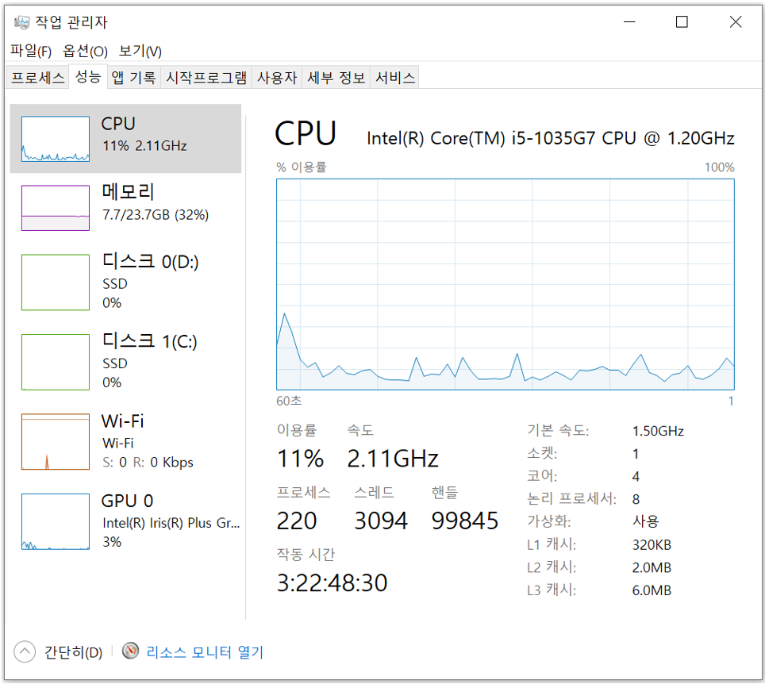

# CPU 성능 확인하기

> 필자의 PC는 `4코어 8스레드 CPU`이고, 한 개의 코어가 2개의 명령어 단위를 동시에 처리할 수 있다. 
>
> 기본 클럭 속도: 1.50GHz, 1초에 클럭이 15억(1.5 x 109)번 반복되는 것을 의미한다. 

 

윈도우 [작업 관리자]의 [성능] 탭의 CPU를 살펴보면, 내 PC의 CPU 정보를 확인할 수 있다. 

- `이용률`: 현재 CPU가 받고 있는 부하의 백분율 
- `속도`: 현재 CPU가 구동되고 있는 **클럭 속도** 
- `프로세스`: 현재 프로세스가 실행되고 있는 수 (= 실행되고 있는 프로그램의 수) 
- `스레드`: 소프트웨어 스레드의 수
- `핸들`: CPU가 인지하고 있는 핸들 ID 개수 
- `작동시간`: 현재 CPU가 켜진 이후 동작하고 있는 시간을 표시 
- `기본속도`: CPU의 기본 클럭 속도 
- `소켓`: CPU의 갯수 
- `코어`: 현재 CPU의 물리적 코어 수 
- `논리 프로세서`: 하드웨어 스레드 수 
- `가상화`: 해당 CPU로 가상머신(VM)을 구동할 수 있는지 표시 
- `L1~L3 캐시`: L1~L3 캐시의 용량 

---