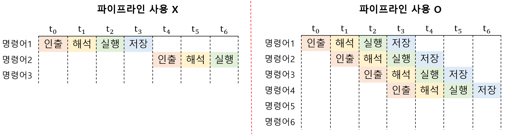
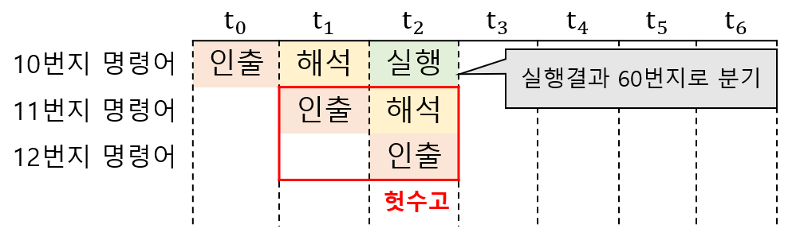
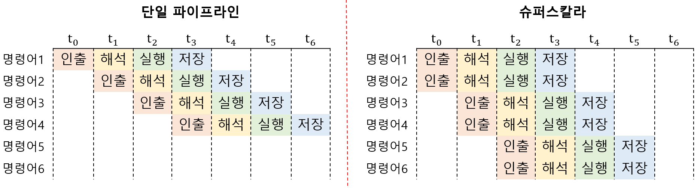
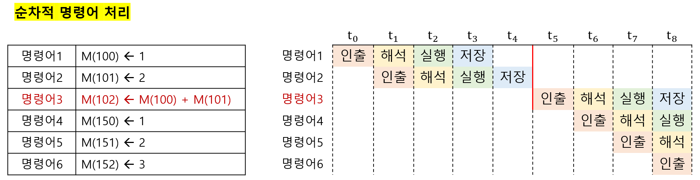
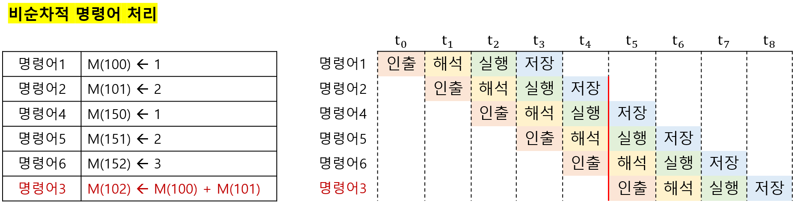

# 명령어 병렬 처리 기법

## 01. 명령어 병렬 처리 기법(Instruction-Level Parallelism)

`명령어 병렬 처리 기법(ILP)`: 명령어를 동시에 처리해 CPU를 쉬지 않고 작동시키는 기법<br>

명령어 병렬 처리 기법에는 '명령어 파이프라이닝', '슈퍼스칼라', '비순차적 명령어 처리' 등이 있다.<br>

---

## 02. 명령어 파이프라이닝(instruction pipelining)

하나의 명령어가 처리되는 과정을 클럭 단위로 나누면 일반적으로 다음과 같다.<br>

- 명령어 인출 (instruction fetch)<br>
- 명령어 해석 (instruction decode)<br>
- 명령어 실행 (execute instruction)<br>
- 결과 저장 (write back)<br>

<br>



같은 단계가 겹치지 않는다면, CPU는 파이프라인을 통해 명령어들을 동시에 실행할 수 있다.<br>

`명령어 파이프라이닝`: 명령어들을 명령어 파이프라인에 넣고, 동시에 처리하는 기법<br>

---

## 03. 파이프라인 위험(pipeline hazard)

`파이프라인 위험`: 특정 상황에서 파이프라이닝이 실패하는 경우를 의미<br>

파이프라인 위험에는 '데이터 위험', '제어 위험', '구조적 위험'이 있다.<br>

<br>

### I. 데이터 위험(data hazard)

`데이터 위험`: 명렁어 간 **데이터 의존성**에 의해 발생<br>

```pseudocode
// 명령어1
R1 <- R2 + R3

// 명령어2
R4 <- R1 + R5
```

위의 경우 명령어1을 완전히 수행하고 난 후, 명령어2를 수행할 수 있다.<br>

즉, 명령어2는 명령어1의 데이터에 의존적이다.<br>

이렇듯, 데이터 위험은 데이터 의존적인 두 명령어를 동시에 실행하려고 할 때 발생한다.<br>

<br>

### II. 제어 위험(control hazard)



`제어 위험`: 분기 등으로 인한 프로그램 카운터의 갑작스러운 변화에 의해 발생<br>

기본적으로 프로그램 카운터는 현재 실행중인 명령어의 다음 주소로 갱신된다.<br>

하니만 프로그램의 실행 흐름이 바뀌어 프로그램 카운터 값에 갑작스러운 변화가 생기면,<br>

명령어 파이프라인에 미리 갖고 와서 실행하고 있던 명령어들은 쓸모가 없어진다.<br>

`분기 예측(branch prediction)`: 프로그램이 어디로 분기할지 미리 예측하는 기술, 제어 위험을 예방하는데 사용.<br>

<br>

### III. 구조적 위험(structural hazard)

`구조적 위험`: 서로 다른 명령어가 동시에 같은 CPU 부품을 사용하려 할 때 발생<br>

이런 점에서 `자원 위험(resource hazard)`이라고도 부른다.<br>

---

## 04. 슈퍼스칼라(superscalar)



`슈퍼스칼라`: CPU 내부에 여러 개의 명령어 파이프라인을 포함한 구조<br>

`슈퍼스칼라 프로세서`: 슈퍼스칼라 구조로 명령어 처리가 가능한 CPU (대부분의 CPU)

- 이론적으로는 파이프라인 갯수에 비례하여 프로그램 속도가 빨라진다.<br>

- 실제로는 파이프라인 위험 등의 문제가 있어, 항상 갯수에 비례해 빨라지지는 않는다.<br>

- 여러 개의 파이라인을 사용하는 만큼, 파이프라인 위험을 방지하기 위해 고도로 설계되어야 한다.<br>

---

## 05. 비순차적 명령어 처리(Out-of-Order Execution)

`비순차적 명령어 처리(OoOE)`: 파이프라인의 중단을 방지하기 위해, 명령어를 순차적으로 처리하지 않는 기법<br>

### I. 순차적 명령어 처리



위 그림에서 명령어3은 명령어1과 명령어2의 데이터에 의존적이다.<br>

명령어3은 반드시 명령어1과 명령어2의 수행이 끝나고 실행되어야 한다.<br>

<br>

### II. 비순차적 명령어 처리



하지만 명령어3을 뒤의 명령어들과 순서를 바꿔도 실행에는 아무런 문제가 없고,<br>

오히려 파이프라인이 멈추지 않아 순차적으로 명령어를 실행할 때 보다 더 효율적이다.<br>

비순차적 명령어 처리가 가능한 CPU는 `명령어 간 데이터 의존성`과, 순서를 바꿔도 상관없는 명령어들을 판단할 수 있어야 한다.<br>

---
