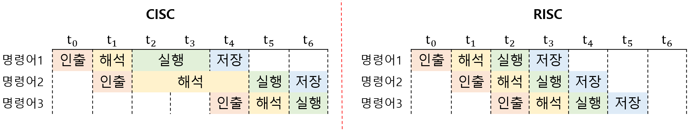

# CISC와 RISC

## 01. 명령어 집합 구조(Instruction Set Architecture)

`명령어 집합 구조(ISA)`: CPU가 이해할 수 있는 명령어들의 집합 

일종의 CPU의 언어이자, 하드웨어가 소프트웨어를 어떻게 이해할지에 대한 약속 

- 인텔의 CPU는 `x86 ISA`를 이해하고, 애플의 CPU는 `ARM ISA`를 이해한다. 

- ISA가 다르다 = 제어장치, 레지스터 작동 방식, 메모리 관리 방법 등이 다르다 :arrow_right: CPU 하드웨어 설계 차이 

---

## 02. CISC (Complex Instruction Set Computer)

`CISC`: 복잡하고 다양한 명령어들을 활용하는 CPU 설계 방식 

인텔의 x86, x86-64가 대표적인 CISC 기반의 ISA다. 

복잡하고 다양한 기능을 제공하기 위해 `가변 길이 ISA`를 활용한다. 

 

### I. 장점

- 상대적으로 적은 수의 명령어로도 프로그램을 실행할 수 있다. 

- 명령어와 메모리에 접근하는 주소 지정 방식이 다양하다 :arrow_right: 다양한 기능을 제공할 수 있다. 

### II. 단점

- 클럭주기와 실행시간이 일정하지 않다. :arrow_right: 파이프라이닝하기 어렵다. 

- 사실 CISC의 복잡한 명령어는 사용빈도가 매우 낮다. 

---

## 03. RISC (Reduced Instruction Set Computer)

`RISC`: 단순하고 적은 명령어들을 활용하는 CPU 설계 방식 

애플의 ARM이 대표적인 RISC 기반의 ISA다. 

되도록 1클럭 내외로 실행되는 `고정 길이 ISA`를 활용한다. 

 

### I. 장점

- 메모리에 접근하는 명령어를 2개(`load`, `store`)로 제한 :arrow_right: 메모리 접근의 단순화, 최소화를 추구한다. 

- 레지스터를 적극적으로 활용 :arrow_right: 레지스터 연산과 범용 레지스터의 개수가 더 많은 편이다. 

- 파이프 라이닝하기 쉽다. 

### II. 단점

- 명령어의 크기가 규격화 :arrow_right: 프로그램을 구성하는 명령어 수가 CISC보다는 많은 편이다. (실제로 같은 코드를 컴파일해도 ARM의 명령어 수가 x86의 명령어 수보다 많다)

- CISC 방식보다 주소 지정 방식의 종류가 적은 편 (레지스터를 활용해서 보완) 

---