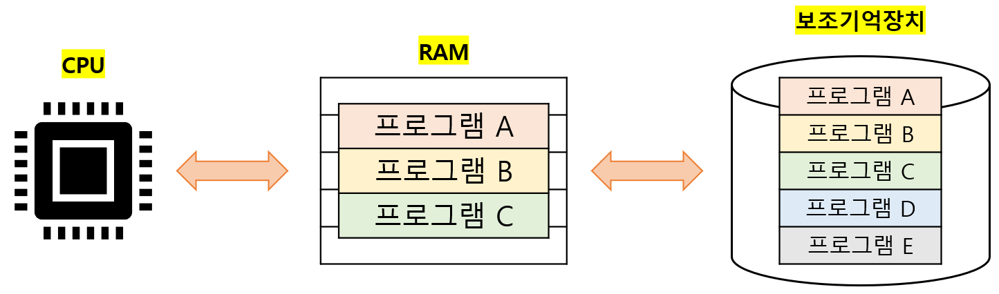

# RAM의 특징과 종류

## 01. 주기억장치(main memory)

`주기억장치`: 현재 실행되는 프로그램의 명령어와 데이터를 저장하는 부품 

주기억장치의 종류로는 RAM과 ROM이 있지만, 

우리가 `메모리`로 지칭하는 저장 장치는 `RAM (Random Access Memory)`을 의미한다. 

---

## 02. RAM의 특징

### I. RAM vs 보조기억장치

RAM은 `휘발성 저장 장치(volatile memory)`다 :arrow_right: 전원을 끄면 저장된 내용이 사라진다. 

보조기억장치는 `비휘발성 저장 장치(non-volatile momory)`다 :arrow_right: 전원을 꺼도 저장된 내용이 유지된다. 

따라서 일반적으로 RAM에는 '실행할 대상'을 저장하고, 보조기억장치에는 '보관할 대상'을 저장한다. 

 

### II. RAM의 성능

CPU는 RAM에는 직접 접근할 수 있지만, 보조기억장치에는 직접 접근할 수 없다. 

따라서 CPU가 실행하고 싶은 프로그램이 보조기억장치에 있다면 RAM으로 복사, 저장한 뒤 실행한다. 

RAM의 용량이 크다 :arrow_right: 많은 프로그램을 가져올 수 있다 :arrow_right: 성능 향상 

---

## 03. RAM의 종류

### I. DRAM (=Dynamic RAM)

시간이 지나면 저장된 데이터가 점차 사라지는 RAM 

데이터의 소멸을 막기 위해 일정 주기로 데이터를 재활성화 해야 한다. 

소비전력이 낮고, 가격이 싸고, 집적도가 높다는 장점이 있다. 

일반적으로 `메모리`로써 사용하는 RAM은 DRAM이다. 

 

### II. SRAM (=Static RAM)

시간이 지나도 저장된 데이터가 사라지지 않는 RAM 

SRAM은 주기적으로 데이터를 재활성화 할 필요가 없고, DRAM보다 속도도 더 빠르다. 

DRAM에 비해 소비전력이 높고, 가격이 비싸고, 집적도가 낮다는 단점이 있다. 

`캐시 메모리` 같은 대용량으로 만들 필요는 없지만 속도가 빨라야 하는 장치에 사용된다. 

SRAM도 RAM의 한 종류이기 때문에, 전원이 차단되면 저장된 내용이 사라진다. 

 

### III. SDRAM (=Synchronous Dynamic RAM)

클럭 신호와 동기화되어, 클럭마다 CPU와 정보를 주고 받을 수 있는 DRAM 

 

### IV. DDR SDRAM (=Double Data Rate SDRAM)

대역폭을 넓혀 속도를 빠르게 만든 SDRAM 

대역폭(data rate)은 데이터를 주고 받는 길의 너비를 의미한다. 

- `SDR SDRAM`: 한 클럭당 하나의 데이터를 주고 받을 수 있는 SDRAM (1배) 
- `DDR SDRAM`: SDRAM에 비해 두 배의 대역폭으로 데이터를 주고 받을 수 있다. (2배) 
- `DDR2 SDRAM`: SDRAM의 대역폭 x 4배 
- `DDR3 SDRAM`: SDRAM의 대역폭 x 8배 
- `DDRn SDRAM`: SDRAM의 대역폭 x 2n배 

---
