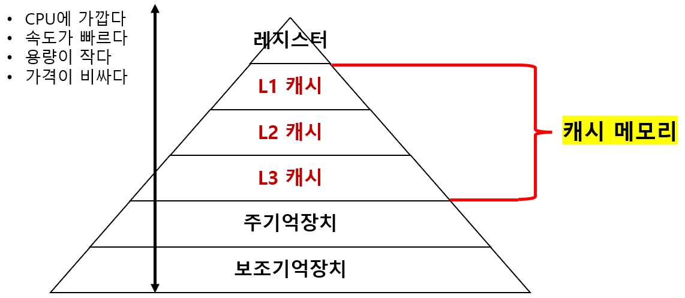
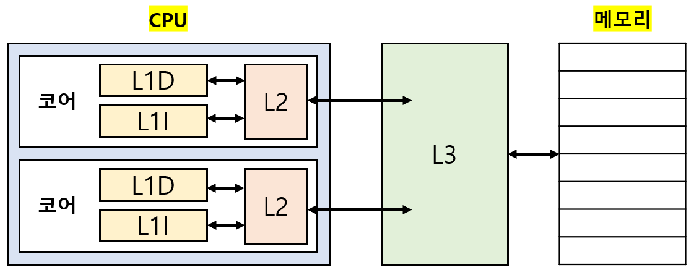

# 캐시 메모리

## 01. 캐시 메모리

### I. 저장 장치 계층 구조(momory hierarchy)

`저장 장치 계층 구조`: 각기 다른 용량과 성능의 저장 장치들을 계층화해 표현한 구조 

- **위 계층**: CPU와 가까워 속도가 빠르고, 용량이 작고, 가격이 비싸다. 

- **아래 계층**: CPU와 멀어 속도가 느리고, 용량이 크고, 가격이 싸다. 

 

### II. 캐시 메모리(cache momory)

CPU와 메모리 사이에 위치한 `SRAM` 기반의 저장 장치다. 

레지스터보다 용량이 크고, 메모리보다 속도가 빠르다. 

즉, CPU의 연산 속도와 메모리 접근 속도의 차이를 줄이기 위한 저장 장치다. 

메모리에서 CPU가 사용할 일부 데이터를 미리 캐시 메모리로 가져와 활용하는 방식 

 

### III. 캐시 메모리 구조

코어와 가장 가까운 순서대로 `L1 캐시`, `L2 캐시`, `L3 캐시`다. 

일반적으로 L1, L2 캐시는 `코어 내부`에, L3 캐시는 `코어 외부`에 위치해 있다. 

**멀티 코어 프로세서**의 경우 L1, L2는 코어마다 할당되고, L3는 여러 코어가 공유하는 형태다. 

`분리형 캐시(split cache)`: L1 캐시를 분리 (`L1I`: 명령어만을 저장, `L1D`: 데이터만을 저장) 

---

## 02. 참조 지역성 원리(locality of reference)

캐시 메모리는 CPU가 사용할 법할 대상을 `예측`해 메모리의 일부를 복사해 저장한다. 

- `캐시 히트(cache hit)`: 예측한 데이터가 실제로 들어맞아 CPU에서 활용하는 경우 

- `캐시 미스(cache miss)`: 예측이 틀려 메모리에서 필요한 데이터를 직접 가져와야 되는 경우 

- `캐시 적중률(cache hit ratio)`: 캐시 히트 횟수 / (캐시 히트 횟수 + 캐시 미스 횟수) 

- 일반적인 컴퓨터의 캐시 적중률은 85~95%다. 

 

캐시 메모리는 참조 지역성의 원리에 따라 메모리로부터 가져올 데이터를 결정한다. 

`참조 지역성의 원리`: CPU가 메모리에 접근할 때의 주된 경향을 바탕으로 만들어진 원리 

- `시간 지역성(temporal locality)`: 최근에 접근했던 메모리 공간에 다시 접근하려는 경향 

- `공간 지역성(spatial locality)`: 접근한 메모리 공간 근처를 접근하려는 경향 

