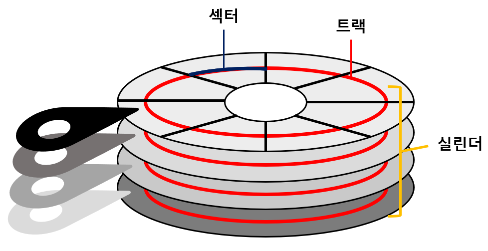
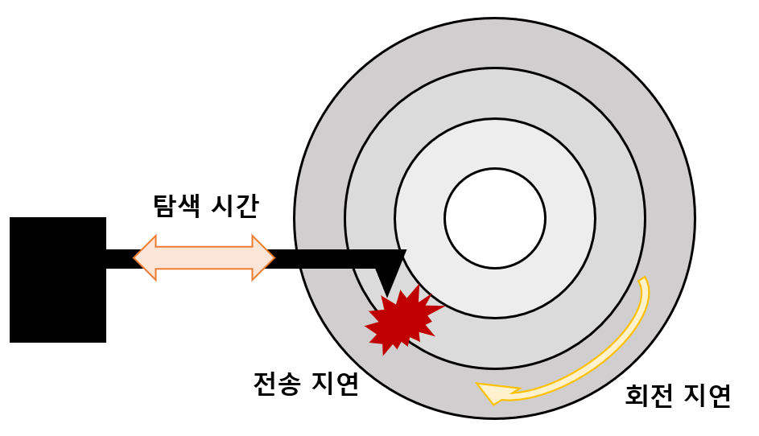

# 보조기억장치 종류

## 01. 보조기억장치

`보조기억장치(secondary storage)`: 전원이 꺼져도 보관할 프로그램을 저장하는 부품 

대중적인 보조기억장치에는 '하드 디스크'와 '플래시 메모리'가 있다. 

---

 ## 02. 하드디스크(Hard Disk Drive)

### I. 하드디스크의 구성

`하드 디스크(HDD)`: 자기적인 방식으로 데이터를 저장하는 보조기억장치 (자기 디스크의 일종) 

- `플래터(platter)`: 하드 디스크에서 실질적으로 데이터가 저장되는 동그란 원판 
  - 플래터는 자기 물질로 덮여 있어 수많은 N극 S극으로 저장된다 (0과 1의 역할) 
  - 많은 데이터를 저장해야 하기 때문에, 여러 겹의 플래터를 양면으로 사용한다. 

- `스핀들(spindle)`: 플래터를 회전시키는 구성 요소 
  - 스핀들이 플래터를 돌리는 속도의 단위: `RPM` 이다 (분당 회전수) 

- `헤드(head)`: 플래터를 대상으로 데이터를 읽고 쓰는 바늘 같이 생긴 구성 요소 
  - 양면 플래터를 사용하는 경우, 플래터당 2개의 헤드가 사용된다. 

- `디스크 암(dist arm)`: 헤더를 원하는 위치로 이동하는 장치 

 

- `트랙(track)`: 플래터를 여러 동심원으로 나누었을 때, 그중 하나의 원을 부르는 개념 

- `섹터(sector)`: 트랙을 조각으로 나눈 하드 디스크의 가장 작은 전송 단위 (보통 512byte) 

- `실린더(cylinder)`: 여러 겹의 플래터 상에서 같은 트랙끼리 연결한 원통 모양의 논리적 단위 
  - 연속된 정보는 보통 한 실린더에 기록된다 (디스크 암을 움직이지 않아도 되기 때문) 
  - ex) 4개의 정보 저장 :arrow_right: 플래터1 앞면, 플래터1 뒷면, 플래터2 앞면, 플래터2 뒷면에 저장 

 

### II. 하드 디스크가 데이터에 접근하는 시간

하드 디스크가 데이터에 접근하는 시간은 크게 세가지로 나뉜다. 

- `탐색 시간(seek time)`: 데이터가 저장된 트랙까지 헤드를 이동시키는 시간 

- `회전 지연(rotational latency)`: 헤드가 있는 곳으로 플래터를 회전시키는 시간 

- `전송 시간(transfer time)`: 하드 디스크와 컴퓨터 간에 데이터를 전송하는 시간 

 

### III. 다중 헤드 디스크 vs 고정 헤드 디스크

`단일 헤드 디스크(single-head disk)`: 플래터의 한 면에 헤드가 하나씩 달린다. 

- 데이터가 있는 곳까지 헤드를 움직여야 한다 :arrow_right: 이동 헤드 디스크(movable-head disk) 

`다중 헤드 디스크(multi-head disk)`: 플러터의 트랙 별로 헤드가 여러 개 달린다. 

- 트랙 마다 헤드가 있어 탐색 시간 = 0 :arrow_right: 고정 헤드 디스크(fixed-head disk) 

---

## 03. 플래시 메모리(flash memory)

`플래시 메모리`: 전기적으로 데이터를 읽고 쓸 수 있는 반도체 기반의 저장 장치 

- 플래시 메모리 기반의 저장 장치에는 'USB 메모리', 'SD 카드', SSD 등이 있다. 

- 크게 NAND 플래시 메모리와 NOR 플래시 메모리가 있는데, 대부분 NAND 플래시 메모리를 지징한다. 

 

### I. 플래시 메모리 종류

`셀(cell)`: 플래시 메모리에서 데이터를 저장하는 가장 작은 단위 

하나에 셀에 몇 개의 비트를 저장할 수 있는지에 따라 플래시 메모리의 종류가 나뉜다. 

- `SLC (Single Level Cell)`: 하나의 셀에 비트 1개 저장 가능 :arrow_right: 2개의 정보 표현 가능 
  - 수명이 길다 / 읽기, 쓰기 속도가 빠르다 / 가격이 높다 

- `MLC (Multiple Level Cell)`: 하나의 셀에 비트 2개 저장 가능 :arrow_right: 22개의 정보 표현 가능 
  - 수명 보통 / 읽기, 쓰기 속도 보통 / 가격 보통 

- `TLC (Triple-Level Cell)`: 하나의 셀에 비트 3개 저장 가능 :arrow_right: 23개의 정보 표현 가능 
  - 수명이 짧다 / 읽기, 쓰기 속도가 느리다 / 가격이 낮다 

 

### II. 플래시 메모리 구조

플래시 메모리의 가장 작은 단위는 `셀(cell)`이다. 

셀들이 모여 `페이지(page)`를 이루고, 페이지들이 모여 `블록(block)`을 이룬다. 

블록들이 모여 `플레인(plane)`을 이루고, 플레인들이 모여 `다이(die)`가 된다. 

 

플래시 메모리는 읽기/쓰기 단위와 삭제 단위가 다르다는 것이 가장 큰 특징이다. 

- 메모리를 읽고 쓰는 단위: `셀(cell)` 

- 메모리를 삭제하는 단위: `블록(block)` 

 

### III. 가비지 컬렉션 (garbage collection)

플래시 메모리의 `페이지`는 3개의 상태를 가질 수 있다. 

- `Free 상태`: 어떠한 데이터도 저장하고 있지 않아, 새로운 데이터를 저장할 수 있는 상태 

- `Valid 상태`: 이미 유효한 데이터를 저장하고 있는 상태 

- `Invalid 상태`: 유효하지 않은 쓰레기 값이 저장되고 있는 상태 

 

플래시 메모리에서 덮어쓰기는 불가능하다. 

따라서 기존의 내용을 용량의 낭비 없이 수정하기 위해 `가비지 컬렉션` 기능을 제공한다. 

- 유효한 페이지들만 새로운 블록으로 복사한다. 

- 복사한 기존 블록을 삭제해 공간을 정리해 용량의 낭비를 방지한다. 

---