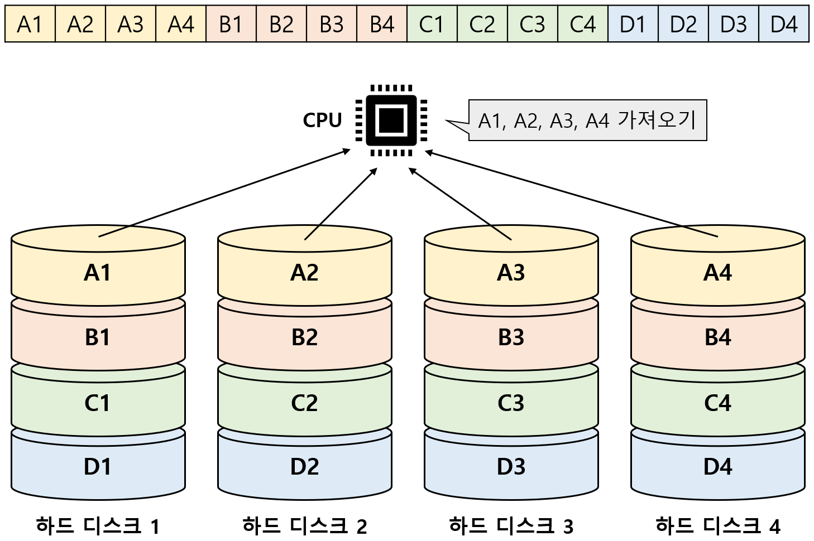
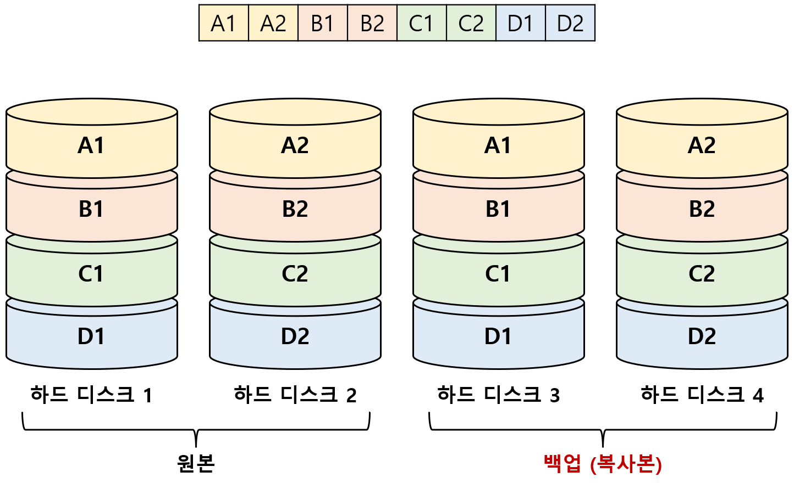
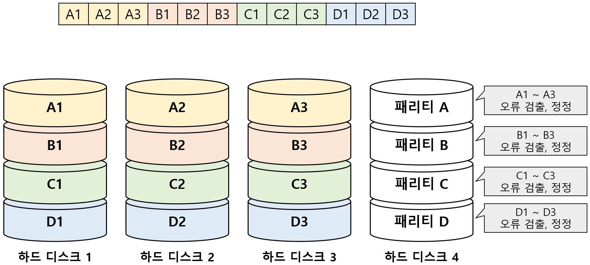
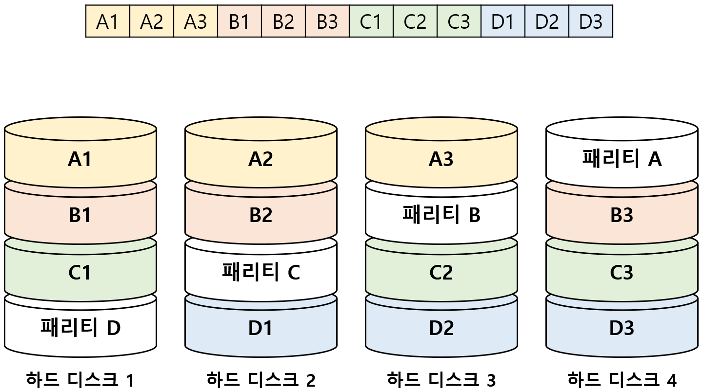
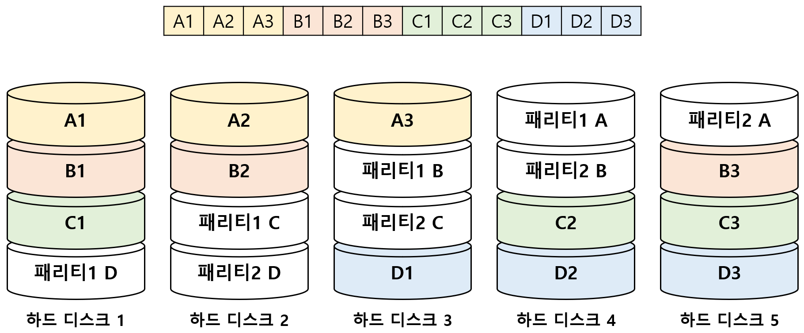

# RAID

## 01. RAID의 정의

`RAID (Redundant Array of Independent Disks)`

- 데이터의 안전성이나 높은 성능을 위해 사용하는 기술 

- 여러 개의 물리적 보조기억장치를 하나의 논리적 보조기억장치처럼 사용하는 기술 

- 주로 HDD, SDD를 사용한다. 

---

## 02. RAID의 종류

`RAID 레벨`: RAID 구성하는 방법 

다양한 RAID 레벨이 있지만 'RAID 0', 'RAID 1', 'RAID 4', 'RAID 5', 'RAID 6'이 대중적이다. 

`Nested RAID`: 여러 RAID 레벨을 혼합한 방식 

 

### I. RAID 0

여러 개의 보조기억장치에 데이터를 단순히 나눠 저장하는 구성 방식 = `스트라이핑(striping)` 

`스트라입(stripe)`: 줄무늬처럼 분산되어 저장된 데이터 

분산 저장을 하면 데이터를 동시에 읽고 쓸 수 있다. (이론상 저장장치 1개 사용하는 것보다 4배 빠르다) 

구성하는 하드 디스크 중 하나라도 문제가 생긴다면, 정보를 읽는 데 문제가 생길 수 있다. 

 

### II. RAID 1

거울처럼 완전한 복사본을 만드는 구성 방식 =`미러링(mirroring)` 

복구가 매우 간단하다는 장점이 있다. 

사용 가능한 용량이 적다는 단점이 있다 :arrow_right: 비용의 문제로 발전할 수도 있다. 

 

### III. RAID 4

완전한 복사본을 만드는 대신, 패리티 정보를 저장한 장치를 두는 구성 방식 

- `패리티 비트(parity bit)`: 오류를 검출하고 복구하기 위한 정보 

- 원래 패리티 비트는 오류 검출만 가능하고, 오류 복구는 불가능하다. 

- 하지만 RAID에서의 패리티 비트는 오류 복구도 가능하다. 

상대적으로 적은 하드 디스크로도 데이터를 안전하게 보관할 수 있다는 장점이 있다. 

데이터를 저장할 때마다 패리티를 저장하는 디스크에도 데이터를 쓴다 :arrow_right: 병목 현상이 발생하는 단점  

 

### IV. RAID 5

패리티 정보를 분산하여 저장하는 방식이다. 

RAID 4에서 발생하는 병목 현상을 해소한다. 

 

### V. RAID 6

기본적으로 RAID 5와 같으나, 서로 다른 2개의 패리티 비트를 두는 방식 

가장 안전성이 높은 구성이라고 볼 수 있다. 

새로운 정보를 저장할 때마다 함께 저장할 패리티 비트가 2개다 :arrow_right: 메모리 저장 속도가 느리다. 

데이터의 저장 속도를 희생하더라도, 데이터를 더욱 안전하게 보관하고 싶을 때 사용한다. 

---