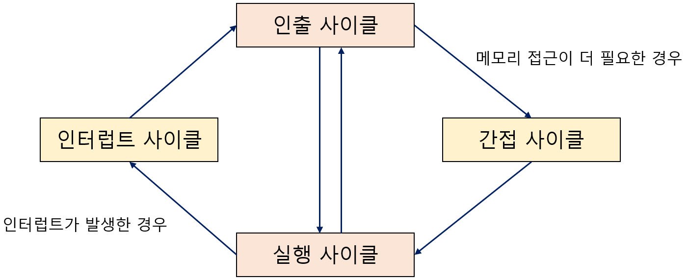

# 명령어 사이클과 인터럽트

## 1. 명령어 사이클

`명령어 사이클(instruction cycle)`: 명령어들이 일정하게 반복하며 실행되는 주기 

프로그램 속 명령어들은 명령어 사이클을 반복하며, 명령어를 순차적으로 실행한다. 

- `인출 사이클(fetch cycle)`: 메모리에 있는 명령어를 CPU로 갖고 오는 단계 

- `실행 사이클(execution cycle)`: CPU로 불러온 명령어를 실행하는 단계 

- `간접 사이클(indirect cycle)`: 메모리 접근을 한 번 더 해야하는 단계 (ex: 간접 주소 지정 방식) 

- `인터럽트 사이클(interrupt cycle)`: 인터럽트를 수행하는 단계 

---

## 2. 인터럽트

`인터럽트(interrupt)`: CPU의 정상적인 작업을 방해하는 신호 

인터럽트는 크게 **동기 인터럽트**와 **비동기 인터럽트**로 구분된다. 

- `동기 인터럽트`: CPU에 의해 발생하는 인터럽트 

- `비동기 인터럽트`: 주로 입출력장치에 의해 발생하는 인터럽트 

 

---

## 3. 동기 인터럽트 (=예외)

[]

`동기 인터럽트(synchronous interrupt)`: CPU에 의해 발생하는 인터럽트 

CPU가 명령어들을 수행하다가 예상치 못한 상황에 마주쳤을 때 발생 (ex: 프로그래밍상의 오류) 

이런 점에서 동기 인터럽트는 `예외(exception)`라고도 부른다. 

예외가 발생하면 CPU는 하던 작업을 중지하고 해당 예외를 처리한다. 

CPU는 예외를 처리하고 