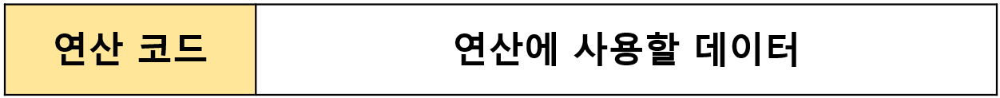
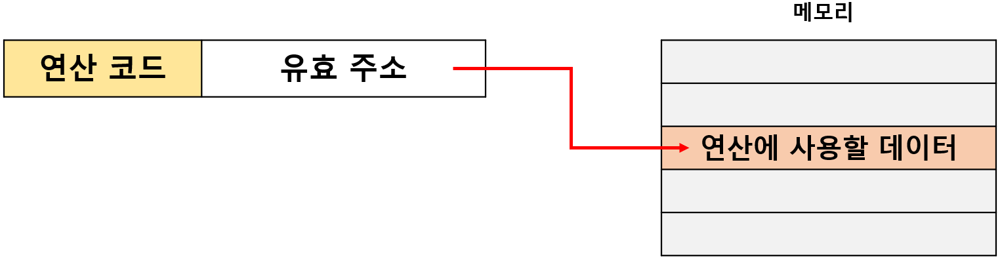
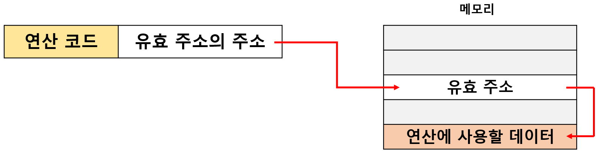
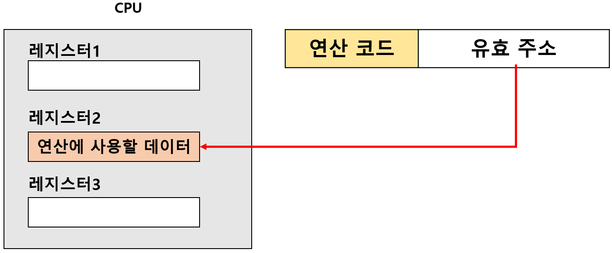
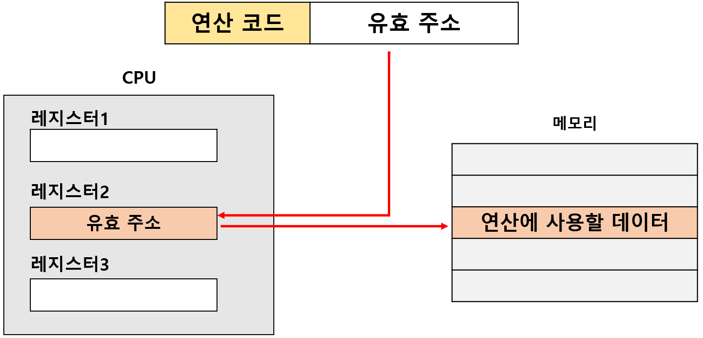

# 주소 지정 방식

## 0. 주소 지정 방식이란?

`유효 주소(effective address)`: 명령어에 사용할 데이터가 저장된 위치 

`주소 지정 방식(addressing mode)`: 유효 주소를 찾는 방법 

---

## 1. 즉시 주소 지정 방식(immediate addressing mode)

`즉시 주소 지정 방식`: 연산에 사용할 **데이터를 오퍼랜드 필드에 직접 명시**하는 방식 

- 연산에 사용할 데이터를 메모리나 레지스터로부터 찾는 과정이 없기 때문에 속도가 빠르다. 
- 표현할 수 있는 데이터의 크기가 작아진다. 

---

## 2. 직접 주소 지정 방식(direct addressing mode)

`직접 주소 지정 방식`: 오퍼랜드 필드에 **유효 주소를 직접적으로 명시**하는 방식 

- 즉시 주소 지정 방식보다 표현할 수 있는 데이터의 크기가 크다. 
- 표현할 수 있는 유효 주소에 제한이 생길 수 있다. 

---

## 3. 간접 주소 지정 방식(indirect addressing mode)

`간접 주소 지정 방식`: 유효 주소의 주소를 오퍼랜드 필드에 명시하는 방식 

- 직접 주소 지정 방식보다 표현할 수 있는 유효 주소의 범위가 크다. 
- 두 번의 메모리 접근이 필요해 속도가 느린 편이다. 

---

## 4. 레지스터 주소 지정 방식(register addressing mode)

`레지스터 주소 지정 방식`: 데이터를 저장할 레지스터를 오퍼랜드 필드에 직접 명시하는 방법 

- 레지스터(=CPU 내부)에 접근하는 것이 메모리(=CPU 외부)에 접근하는 것보다 속도가 더 빠르다. 
- 직접 명시 :arrow_right: 표현할 수 있는 레지스터의 크기에 제한이 생길 수 있다. 

---

## 5. 레지스터 간접 주소 지정 방식(register indirect addressing mode)

`레지스터 간접 주소 지정 방식`: 연산에 사용할 데이터를 메모리에 저장하고, 그 유효 주소를 저장한 레지스터를 오퍼랜드 필드에 명시는 방식 

- 간접 주소 지정 방식과 비슷하지만, 메모리에 접근하는 횟수가 한 번으로 줄어든다는 장점이 있다. 

---

